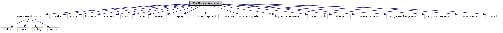

do not remove this div, it is closed by doxygen! 
|  |
| --- |
| NSCL DDAS12.1-001Support for XIA DDAS at FRIB |

 end header part 
 Generated by Doxygen 1.9.1 

 window showing the filter options 

 iframe showing the search results (closed by default) 

- [[dir_6514a8425036055b37d1cc9ce7dc44e6]]
- [[dir_d931a22623696a5d7336a5069a782699]]
- [[dir_012a31d9d824d7c04849b434774f896a]]

 top 
[Variables](#var-members)

DDASDataSimulator.cpp File Reference

header
Implements the class for simulating DDAS-style data recored by NSCLDAQ readout programs.  
[More...](#details)

`#include "DDASDataSimulator.h"`  

`#include <unistd.h>`  

`#include <fcntl.h>`  

`#include <iostream>`  

`#include <memory>`  

`#include <chrono>`  

`#include <cmath>`  

`#include <sstream>`  

`#include <Exception.h>`  

`#include <CErrnoException.h>`  

`#include <NSCLDAQFormatFactorySelector.h>`  

`#include <RingItemFactoryBase.h>`  

`#include <DataFormat.h>`  

`#include <CRingItem.h>`  

`#include <CDataFormatItem.h>`  

`#include <CRingStateChangeItem.h>`  

`#include <CPhysicsEventItem.h>`  

`#include <DDASBitMasks.h>`  

`#include <DDASHit.h>`

Include dependency graph for DDASDataSimulator.cpp:

|  |  |
| --- | --- |
| Variables |
| const uint64_t | LOWER_TS_BIT_MASK= 0x00000000FFFFFFFF |
|  | Mask lower 16 bits.More... |
|  |
| const uint64_t | UPPER_TS_BIT_MASK= 0x0000FFFF00000000 |
|  | Mask upper 16 bits.More... |
|  |
| const uint32_t | PIXIE_MAX_ENERGY= 65535 |
|  | Max allowed energy value.More... |
|  |
| const uint16_t | CFD_100_MSPS_MASK= 0x7FFF |
|  | CFD mask for 100 MSPS modules.More... |
|  |
| const uint16_t | CFD_250_MSPS_MASK= 0x3FFF |
|  | CFD mask for 250 MSPS modules.More... |
|  |
| const uint16_t | CFD_500_MSPS_MASK= 0x1FFF |
|  | CFD mask for 500 MSPS modules.More... |
|  |

## Detailed Description

Implements the class for simulating DDAS-style data recored by NSCLDAQ readout programs.

## Variable Documentation

## [◆](#a60ad102ec9ec37fd80667e478d386f9d)CFD_100_MSPS_MASK

|  |
| --- |
| const uint16_t CFD_100_MSPS_MASK = 0x7FFF |

CFD mask for 100 MSPS modules.

## [◆](#ae8fd459ebc84b078888bd26e2a70d2cf)CFD_250_MSPS_MASK

|  |
| --- |
| const uint16_t CFD_250_MSPS_MASK = 0x3FFF |

CFD mask for 250 MSPS modules.

## [◆](#acd6323973013b322e32e2a04acb1725b)CFD_500_MSPS_MASK

|  |
| --- |
| const uint16_t CFD_500_MSPS_MASK = 0x1FFF |

CFD mask for 500 MSPS modules.

## [◆](#a253f2320a2a890f2f72256bd9fc4b698)LOWER_TS_BIT_MASK

|  |
| --- |
| const uint64_t LOWER_TS_BIT_MASK = 0x00000000FFFFFFFF |

Mask lower 16 bits.

## [◆](#ae8dd2171a4241ba5e60d13d6881155b0)PIXIE_MAX_ENERGY

|  |
| --- |
| const uint32_t PIXIE_MAX_ENERGY = 65535 |

Max allowed energy value.

## [◆](#a8fdb2cce0d488e2c0f2551669d695d39)UPPER_TS_BIT_MASK

|  |
| --- |
| const uint64_t UPPER_TS_BIT_MASK = 0x0000FFFF00000000 |

Mask upper 16 bits.

 contents 
 start footer part 

---

Generated by  1.9.1
