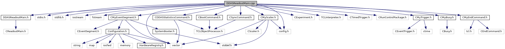

do not remove this div, it is closed by doxygen! 
|  |
| --- |
| NSCL DDAS12.1-001Support for XIA DDAS at FRIB |

 end header part 
 Generated by Doxygen 1.9.1 

 window showing the filter options 

 iframe showing the search results (closed by default) 

- [[dir_6514a8425036055b37d1cc9ce7dc44e6]]
- [[dir_9ad3e8fcfa94677d694c5b48d5640f86]]

 top 
[Functions](#func-members) |
[Variables](#var-members)

DDASReadoutMain.cpp File Reference

header
Implementation of the production DDAS readout code.  
[More...](#details)

`#include "DDASReadoutMain.h"`  

`#include <stdio.h>`  

`#include <stdlib.h>`  

`#include <iostream>`  

`#include <fstream>`  

`#include <vector>`  

`#include <config.h>`  

`#include <CExperiment.h>`  

`#include <TCLInterpreter.h>`  

`#include <CTimedTrigger.h>`  

`#include <CRunControlPackage.h>`  

`#include "CDDASStatisticsCommand.h"`  

`#include "CSyncCommand.h"`  

`#include "CBootCommand.h"`  

`#include "CMyEventSegment.h"`  

`#include "CMyTrigger.h"`  

`#include "CMyBusy.h"`  

`#include "CMyEndCommand.h"`  

`#include "CMyScaler.h"`

Include dependency graph for DDASReadoutMain.cpp:

|  |  |
| --- | --- |
| Functions |
| CMyTrigger* | mytrigger(0) |
|  | Newing them here makes order of construction.More... |
|  |
| CMyEventSegment* | myeventsegment(0) |
|  |

|  |  |
| --- | --- |
| Variables |
| std::vector<CMyScaler* > | scalerModules |
|  | List of scalar modules.More... |
|  |
| CTCLApplication * | gpTCLApplication= newDDASReadoutMain |
|  |

## Detailed Description

Implementation of the production DDAS readout code.

## Function Documentation

## [◆](#af0679cf89dc71abfa7b144c1ccd904df)myeventsegment()

|  |  |  |  |  |  |
| --- | --- | --- | --- | --- | --- |
| CMyEventSegment* myeventsegment | ( | 0 |  | ) |  |

Un-controlled - now new'd in SetupReadout.

## [◆](#a843710c4ed719c4c4d91cc6f187cc8d4)mytrigger()

|  |  |  |  |  |  |
| --- | --- | --- | --- | --- | --- |
| CMyTrigger* mytrigger | ( | 0 |  | ) |  |

Newing them here makes order of construction.

## Variable Documentation

## [◆](#a0a55eac25fc9e9b854ace6c606c69669)gpTCLApplication

|  |
| --- |
| CTCLApplication* gpTCLApplication = newDDASReadoutMain |

## [◆](#a6d9a9ecbb3da77dce1f351c836d8c660)scalerModules

|  |
| --- |
| std::vector<CMyScaler*> scalerModules |

List of scalar modules.

 contents 
 start footer part 

---

Generated by  1.9.1
