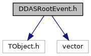
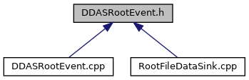

do not remove this div, it is closed by doxygen! 
|  |
| --- |
| NSCL DDAS12.1-001Support for XIA DDAS at FRIB |

 end header part 
 Generated by Doxygen 1.9.1 

 window showing the filter options 

 iframe showing the search results (closed by default) 

- [ddas](https://github.com/FRIBDAQ/docs/tree/main/ddas-12.1-001/dir_6514a8425036055b37d1cc9ce7dc44e6.md)
- [ddasdumper](https://github.com/FRIBDAQ/docs/tree/main/ddas-12.1-001/dir_3bbf1c6b836d16f0cd5f6a50630f820c.md)

 top 
[Classes](#nested-classes)

DDASRootEvent.h File Reference

header
Defines a class to encapsulate the information in a built DDAS event.  
[More...](#details)

`#include <TObject.h>`  

`#include <vector>`

Include dependency graph for DDASRootEvent.h:

This graph shows which files directly or indirectly include this file:

[Go to the source code of this file.](https://github.com/FRIBDAQ/docs/tree/main/ddas-12.1-001/DDASRootEvent_8h_source.md)

|  |  |
| --- | --- |
| Classes |
| class | DDASRootEvent |
|  | Encapsulates a built DDAS event with added capabilities for writing to ROOT files.More... |
|  |

## Detailed Description

Defines a class to encapsulate the information in a built DDAS event.

 contents 
 start footer part 

---

Generated by  1.9.1
