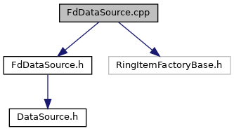

do not remove this div, it is closed by doxygen! 
|  |
| --- |
| NSCL DDAS12.1-001Support for XIA DDAS at FRIB |

 end header part 
 Generated by Doxygen 1.9.1 

 window showing the filter options 

 iframe showing the search results (closed by default) 

- [[ddas|https://github.com/FRIBDAQ/docs/tree/main/ddas-12.1-001/dir_6514a8425036055b37d1cc9ce7dc44e6.md]]
- [[ddasdumper|https://github.com/FRIBDAQ/docs/tree/main/ddas-12.1-001/dir_3bbf1c6b836d16f0cd5f6a50630f820c.md]]

 top 
FdDataSource.cpp File Reference

header
Implementation of the file descriptor data source.  
[More...](#details)

`#include "FdDataSource.h"`  

`#include <RingItemFactoryBase.h>`

Include dependency graph for FdDataSource.cpp:

## Detailed Description

Implementation of the file descriptor data source.

 contents 
 start footer part 

---

Generated by  1.9.1
