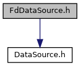
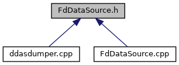

do not remove this div, it is closed by doxygen! 
|  |
| --- |
| NSCL DDAS12.1-001Support for XIA DDAS at FRIB |

 end header part 
 Generated by Doxygen 1.9.1 

 window showing the filter options 

 iframe showing the search results (closed by default) 

- [[dir_6514a8425036055b37d1cc9ce7dc44e6]]
- [[dir_3bbf1c6b836d16f0cd5f6a50630f820c]]

 top 
[Classes](#nested-classes)

FdDataSource.h File Reference

header
Data source of undifferentiated ring items from a file descriptor.  
[More...](#details)

`#include "DataSource.h"`

Include dependency graph for FdDataSource.h:

This graph shows which files directly or indirectly include this file:

[[FdDataSource_8h_source]]

|  |  |
| --- | --- |
| Classes |
| class | FdDataSource |
|  | A class taking the file descriptor as a data source. Most commonly used to construct a data source from stdin.More... |
|  |

## Detailed Description

Data source of undifferentiated ring items from a file descriptor.

 contents 
 start footer part 

---

Generated by  1.9.1
