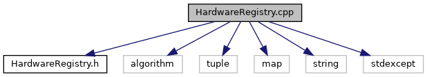

do not remove this div, it is closed by doxygen! 
|  |
| --- |
| NSCL DDAS12.1-001Support for XIA DDAS at FRIB |

 end header part 
 Generated by Doxygen 1.9.1 

 window showing the filter options 

 iframe showing the search results (closed by default) 

- [[dir_6514a8425036055b37d1cc9ce7dc44e6]]
- [[dir_1ad96cec73befb7849da500ecefc5069]]

 top 
[Typedefs](#typedef-members) |
[Functions](#func-members)

HardwareRegistry.cpp File Reference

header
Implement functions in the namespace used to store the DDAS hardware information.  
[More...](#details)

`#include "HardwareRegistry.h"`  

`#include <algorithm>`  

`#include <tuple>`  

`#include <map>`  

`#include <string>`  

`#include <stdexcept>`

Include dependency graph for HardwareRegistry.cpp:

|  |  |
| --- | --- |
| Typedefs |
| using | Registry= std::map< int,HR::HardwareSpecification> |
|  | Map of hardware specifications (MSPS, bit depth, revision, calibration) keyed by the hardware type.More... |
|  |

|  |  |
| --- | --- |
| Functions |
| bool | operator==(constHR::HardwareSpecification&lhs, constHR::HardwareSpecification&rhs) |
|  | Check if two HardwareSpecifications are the same.More... |
|  |

## Detailed Description

Implement functions in the namespace used to store the DDAS hardware information.

## Typedef Documentation

## [◆](#ac22094b1eef40bd04e302d1dc2161134)Registry

|  |
| --- |
| Registry |

Map of hardware specifications (MSPS, bit depth, revision, calibration) keyed by the hardware type.

## Function Documentation

## [◆](#adc70aeb7f5bc652ce834dfc571905acf)operator==()

|  |  |  |  |
| --- | --- | --- | --- |
| bool operator== | ( | constDAQ::DDAS::HardwareRegistry::HardwareSpecification& | lhs, |
|  |  | constDAQ::DDAS::HardwareRegistry::HardwareSpecification& | rhs |
|  | ) |  |  |

Check if two HardwareSpecifications are the same.

Parameters
|  |  |
| --- | --- |
| lhs,rhs | Left- and right-hand objects for comparison. |

Returnsbool 
Return values
|  |  |
| --- | --- |
| true | If lhs and rhs are equal. |
| false | Otherwise. |

 contents 
 start footer part 

---

Generated by  1.9.1
