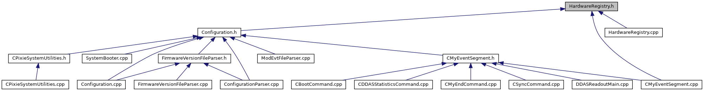

do not remove this div, it is closed by doxygen! 
|  |
| --- |
| NSCL DDAS12.1-001Support for XIA DDAS at FRIB |

 end header part 
 Generated by Doxygen 1.9.1 

 window showing the filter options 

 iframe showing the search results (closed by default) 

- [[ddas|dir_6514a8425036055b37d1cc9ce7dc44e6]]
- [[configuration|dir_1ad96cec73befb7849da500ecefc5069]]

 top 
[Classes](#nested-classes) |
[Namespaces](#namespaces) |
[Enumerations](#enum-members) |
[Functions](#func-members)

HardwareRegistry.h File Reference

header
Defines a namespace used to store information about known DDAS modules.  
[More...](#details)

This graph shows which files directly or indirectly include this file:

[[Go to the source code of this file.|HardwareRegistry_8h_source]]

|  |  |
| --- | --- |
| Classes |
| struct | DAQ::DDAS::HardwareRegistry::HardwareSpecification |
|  | Generic hardware specs for hardware types.More... |
|  |

|  |  |
| --- | --- |
| Namespaces |
|  | DAQ |
|  |
|  | DAQ::DDAS |
|  |
|  | DAQ::DDAS::HardwareRegistry |
|  | TheHardwareRegistrynamespace is where information about all knownDDASmodules are stored. |
|  |

|  |  |
| --- | --- |
| Enumerations |
| enum | DAQ::DDAS::HardwareRegistry::HardwareType{DAQ::DDAS::HardwareRegistry::RevB_100MHz_12Bit=1
,DAQ::DDAS::HardwareRegistry::RevC_100MHz_12Bit=2
,DAQ::DDAS::HardwareRegistry::RevD_100MHz_12Bit=3
,DAQ::DDAS::HardwareRegistry::RevF_100MHz_14Bit=4
,DAQ::DDAS::HardwareRegistry::RevF_100MHz_16Bit=5
,DAQ::DDAS::HardwareRegistry::RevF_250MHz_12Bit=6
,DAQ::DDAS::HardwareRegistry::RevF_250MHz_14Bit=7
,DAQ::DDAS::HardwareRegistry::RevF_250MHz_16Bit=8
,DAQ::DDAS::HardwareRegistry::RevF_500MHz_12Bit=9
,DAQ::DDAS::HardwareRegistry::RevF_500MHz_14Bit=10
,DAQ::DDAS::HardwareRegistry::RevF_500MHz_16Bit=11
,DAQ::DDAS::HardwareRegistry::Unknown=0} |
|  | The HardwareType enum.More... |
|  |

|  |  |
| --- | --- |
| Functions |
| void | DAQ::DDAS::HardwareRegistry::configureHardwareType(int type, const HardwareSpecification &spec) |
|  |
| HardwareSpecification & | DAQ::DDAS::HardwareRegistry::getSpecification(int type) |
|  | Retrieve a reference to the current hdwr specification for a hardware type.More... |
|  |
| void | DAQ::DDAS::HardwareRegistry::resetToDefaults() |
|  |
| int | DAQ::DDAS::HardwareRegistry::computeHardwareType(int hdwrVersion, int adcFreq, int adcRes) |
|  | Compute the hardware type from input specifications.More... |
|  |
| int | DAQ::DDAS::HardwareRegistry::createHardwareType(int hdwrVersion, int adcFreq, int adcRes, double clockCalibration) |
|  | Create an enumerated hardware type from input specifications.More... |
|  |
| bool | operator==(constDAQ::DDAS::HardwareRegistry::HardwareSpecification&lhs, constDAQ::DDAS::HardwareRegistry::HardwareSpecification&rhs) |
|  | Check if two HardwareSpecifications are the same.More... |
|  |

## Detailed Description

Defines a namespace used to store information about known DDAS modules.

## Function Documentation

## [◆](#a44d347fcad4f2736671d8b2778f9c858)operator==()

|  |  |  |  |
| --- | --- | --- | --- |
| bool operator== | ( | constDAQ::DDAS::HardwareRegistry::HardwareSpecification& | lhs, |
|  |  | constDAQ::DDAS::HardwareRegistry::HardwareSpecification& | rhs |
|  | ) |  |  |

Check if two HardwareSpecifications are the same.

Parameters
|  |  |
| --- | --- |
| lhs,rhs | Left- and right-hand objects for comparison. |

Returnsbool 
Return values
|  |  |
| --- | --- |
| true | If lhs and rhs are equal. |
| false | Otherwise. |

 contents 
 start footer part 

---

Generated by  1.9.1
