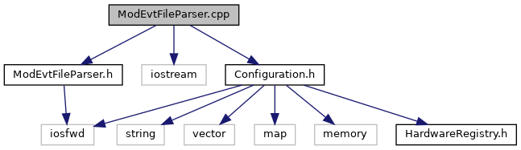

do not remove this div, it is closed by doxygen! 
|  |
| --- |
| NSCL DDAS12.1-001Support for XIA DDAS at FRIB |

 end header part 
 Generated by Doxygen 1.9.1 

 window showing the filter options 

 iframe showing the search results (closed by default) 

- [[dir_6514a8425036055b37d1cc9ce7dc44e6]]
- [[dir_1ad96cec73befb7849da500ecefc5069]]

 top 
ModEvtFileParser.cpp File Reference

header
Implementation of the modevtlen.txt file parser.  
[More...](#details)

`#include "ModEvtFileParser.h"`  

`#include <iostream>`  

`#include "Configuration.h"`

Include dependency graph for ModEvtFileParser.cpp:

## Detailed Description

Implementation of the modevtlen.txt file parser.

 contents 
 start footer part 

---

Generated by  1.9.1
