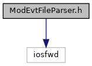
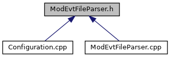

do not remove this div, it is closed by doxygen! 
|  |
| --- |
| NSCL DDAS12.1-001Support for XIA DDAS at FRIB |

 end header part 
 Generated by Doxygen 1.9.1 

 window showing the filter options 

 iframe showing the search results (closed by default) 

- [ddas](https://github.com/FRIBDAQ/docs/tree/main/ddas-12.1-001/dir_6514a8425036055b37d1cc9ce7dc44e6.md)
- [configuration](https://github.com/FRIBDAQ/docs/tree/main/ddas-12.1-001/dir_1ad96cec73befb7849da500ecefc5069.md)

 top 
[Classes](#nested-classes) |
[Namespaces](#namespaces)

ModEvtFileParser.h File Reference

header
Defines a parser for the modevtlen.txt file.  
[More...](#details)

`#include <iosfwd>`

Include dependency graph for ModEvtFileParser.h:

This graph shows which files directly or indirectly include this file:

[Go to the source code of this file.](https://github.com/FRIBDAQ/docs/tree/main/ddas-12.1-001/ModEvtFileParser_8h_source.md)

|  |  |
| --- | --- |
| Classes |
| class | DAQ::DDAS::ModEvtFileParser |
|  | A parser for the modevtlen.txt file.More... |
|  |

|  |  |
| --- | --- |
| Namespaces |
|  | DAQ |
|  |
|  | DAQ::DDAS |
|  |

## Detailed Description

Defines a parser for the modevtlen.txt file.

 contents 
 start footer part 

---

Generated by  1.9.1
