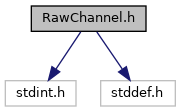
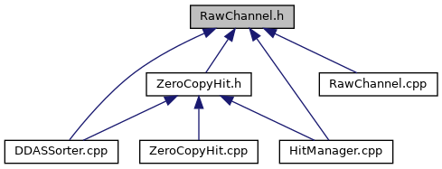

do not remove this div, it is closed by doxygen! 
|  |
| --- |
| NSCL DDAS12.1-001Support for XIA DDAS at FRIB |

 end header part 
 Generated by Doxygen 1.9.1 

 window showing the filter options 

 iframe showing the search results (closed by default) 

- [[ddas|dir_6514a8425036055b37d1cc9ce7dc44e6]]
- [[readout|dir_9ad3e8fcfa94677d694c5b48d5640f86]]

 top 
[Classes](#nested-classes) |
[Namespaces](#namespaces) |
[Functions](#func-members)

RawChannel.h File Reference

header
Defines a raw channel hit storage struct for Readout/sorting.  
[More...](#details)

`#include <stdint.h>`  

`#include <stddef.h>`

Include dependency graph for RawChannel.h:

This graph shows which files directly or indirectly include this file:

[[Go to the source code of this file.|RawChannel_8h_source]]

|  |  |
| --- | --- |
| Classes |
| struct | DDASReadout::RawChannel |
|  | A struct containing a pointer to a hit and its properties.More... |
|  |

|  |  |
| --- | --- |
| Namespaces |
|  | DDASReadout |
|  |

|  |  |
| --- | --- |
| Functions |
| bool | operator<(constDDASReadout::RawChannel&c1, constDDASReadout::RawChannel&c2) |
|  | operator<More... |
|  |
| bool | operator>(constDDASReadout::RawChannel&c1, constDDASReadout::RawChannel&c2) |
|  | operator>More... |
|  |
| bool | operator==(constDDASReadout::RawChannel&c1, constDDASReadout::RawChannel&c2) |
|  | operator==More... |
|  |

## Detailed Description

Defines a raw channel hit storage struct for Readout/sorting.

## Function Documentation

## [◆](#a54cfd566a9b0ddf284bb5ac7927501f3)operator<()

|  |  |  |  |
| --- | --- | --- | --- |
| bool operator< | ( | constDDASReadout::RawChannel& | c1, |
|  |  | constDDASReadout::RawChannel& | c2 |
|  | ) |  |  |

operator<

Parameters
|  |  |
| --- | --- |
| c1,c2 | Channels with timestamps for comparison. |

Returnsbool 
Return values
|  |  |
| --- | --- |
| true | If c1 time < c2 time. |
| false | Otherwise. |

Assumes SetTime() has been called.

## [◆](#adca0b3900d6a1c11b6d8422f951ec3d4)operator==()

|  |  |  |  |
| --- | --- | --- | --- |
| bool operator== | ( | constDDASReadout::RawChannel& | c1, |
|  |  | constDDASReadout::RawChannel& | c2 |
|  | ) |  |  |

operator==

Parameters
|  |  |
| --- | --- |
| c1,c2 | Channels with timestamps for comparison. |

Returnsbool 
Return values
|  |  |
| --- | --- |
| true | If c1 time, c2 time are equal. |
| false | Otherwise. |

Assumes SetTime() has been called.

## [◆](#ad61e97e883c94b4a748a94a712d9dba3)operator>()

|  |  |  |  |
| --- | --- | --- | --- |
| bool operator> | ( | constDDASReadout::RawChannel& | c1, |
|  |  | constDDASReadout::RawChannel& | c2 |
|  | ) |  |  |

operator>

Parameters
|  |  |
| --- | --- |
| c1,c2 | Channels with timestamps for comparison. |

Returnsbool 
Return values
|  |  |
| --- | --- |
| true | If c1 time > c2 time. |
| false | Otherwise. |

Assumes SetTime() has been called.

 contents 
 start footer part 

---

Generated by  1.9.1
