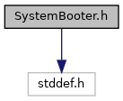
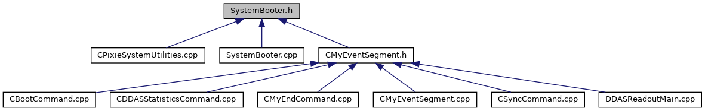

do not remove this div, it is closed by doxygen! 
|  |
| --- |
| NSCL DDAS12.1-001Support for XIA DDAS at FRIB |

 end header part 
 Generated by Doxygen 1.9.1 

 window showing the filter options 

 iframe showing the search results (closed by default) 

- [[ddas|dir_6514a8425036055b37d1cc9ce7dc44e6]]
- [[booter|dir_6ee16d49823f5bdfd30ad95b5fce836e]]

 top 
[Classes](#nested-classes) |
[Namespaces](#namespaces)

SystemBooter.h File Reference

header
Defines a class to manage the booting process for DDAS.  
[More...](#details)

`#include <stddef.h>`

Include dependency graph for SystemBooter.h:

This graph shows which files directly or indirectly include this file:

[[Go to the source code of this file.|SystemBooter_8h_source]]

|  |  |
| --- | --- |
| Classes |
| class | DAQ::DDAS::SystemBooter |
|  | Manages the booting process forDDAS.More... |
|  |

|  |  |
| --- | --- |
| Namespaces |
|  | DAQ |
|  |
|  | DAQ::DDAS |
|  |

## Detailed Description

Defines a class to manage the booting process for DDAS.

 contents 
 start footer part 

---

Generated by  1.9.1
