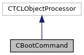

do not remove this div, it is closed by doxygen! 
|  |
| --- |
| NSCL DDAS12.1-001Support for XIA DDAS at FRIB |

 end header part 
 Generated by Doxygen 1.9.1 

 window showing the filter options 

 iframe showing the search results (closed by default)

 top 
[Public Member Functions](#pub-methods) |
[List of all members](https://github.com/FRIBDAQ/docs/tree/main/ddas-12.1-001/classCBootCommand-members.md)

CBootCommand Class Reference

header
This class implements the ddasboot command. It is added to to the Tcl interpreter that runs ddasreadout so that the DDAS modules can be booted on-demand rather than every time the Readout program starts.  
 [More...](https://github.com/FRIBDAQ/docs/tree/main/ddas-12.1-001/classCBootCommand.md#details)

`#include <CBootCommand.h>`

Inheritance diagram for CBootCommand:

[[legend](https://github.com/FRIBDAQ/docs/tree/main/ddas-12.1-001/graph_legend.md)]

Collaboration diagram for CBootCommand:

[[legend](https://github.com/FRIBDAQ/docs/tree/main/ddas-12.1-001/graph_legend.md)]

|  |  |
| --- | --- |
| Public Member Functions |
|  | CBootCommand(CTCLInterpreter &interp, const char *pCmd,CMyEventSegment*pSeg) |
|  | Constructor.More... |
|  |
| virtual | ~CBootCommand() |
|  | Destructor.More... |
|  |
| virtual int | operator()(CTCLInterpreter &interp, std::vector< CTCLObject > &objv) |
|  | Gets control when the command is invoked.More... |
|  |

## Detailed Description

This class implements the ddasboot command. It is added to to the Tcl interpreter that runs ddasreadout so that the DDAS modules can be booted on-demand rather than every time the Readout program starts.

## Constructor & Destructor Documentation

## [◆](#ae452f8c096d86e19bfebe36c6e49fcb7)CBootCommand()

|  |  |  |  |
| --- | --- | --- | --- |
| CBootCommand::CBootCommand | ( | CTCLInterpreter & | interp, |
|  |  | const char * | pCmd, |
|  |  | CMyEventSegment* | pSeg |
|  | ) |  |  |

Constructor.

- Parameters
  |  |  |
  | --- | --- |
  | interp | Reference to the interpreter. |
  | pCmd | Command string. |
  | pSeg | Event segment to manipulate. |

## [◆](#a754153ca87c29bb3a18a4b19ec131ea2)~CBootCommand()

|  |  |  |  |  |  |  |
| --- | --- | --- | --- | --- | --- | --- |
| CBootCommand::~CBootCommand() | CBootCommand::~CBootCommand | ( |  | ) |  | virtual |
| CBootCommand::~CBootCommand | ( |  | ) |  |

Destructor.

## Member Function Documentation

## [◆](#a4a622a9c6a16938f41dcddf546428d30)operator()()

|  |  |  |  |  |  |  |  |  |  |  |  |  |  |
| --- | --- | --- | --- | --- | --- | --- | --- | --- | --- | --- | --- | --- | --- |
| int CBootCommand::operator()(CTCLInterpreter &interp,std::vector< CTCLObject > &objv) | int CBootCommand::operator() | ( | CTCLInterpreter & | interp, |  |  | std::vector< CTCLObject > & | objv |  | ) |  |  | virtual |
| int CBootCommand::operator() | ( | CTCLInterpreter & | interp, |
|  |  | std::vector< CTCLObject > & | objv |
|  | ) |  |  |

Gets control when the command is invoked.

- Parameters
  |  |  |
  | --- | --- |
  | interp | Interpreter executing the command. |
  | objv | Command words. |

- Returns
  Status of the command.

- Return values
  |  |  |
  | --- | --- |
  | TCL_OK | Successful completion. |
  | TCL_ERROR | Failure. Human readable reason is in the intepreter result. |

Ensures there are no additional command parameters. Invokes the segments's boot method.

---

The documentation for this class was generated from the following files:- [CBootCommand.h](https://github.com/FRIBDAQ/docs/tree/main/ddas-12.1-001/CBootCommand_8h_source.md)
- [CBootCommand.cpp](https://github.com/FRIBDAQ/docs/tree/main/ddas-12.1-001/CBootCommand_8cpp.md)

 contents 
 start footer part 

---

Generated by  1.9.1
