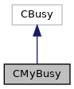

do not remove this div, it is closed by doxygen! 
|  |
| --- |
| NSCL DDAS12.1-001Support for XIA DDAS at FRIB |

 end header part 
 Generated by Doxygen 1.9.1 

 window showing the filter options 

 iframe showing the search results (closed by default)

 top 
[Public Member Functions](#pub-methods) |
[[classCMyBusy-members]]

CMyBusy Class Reference

header
Provides a busy command to override the SBS one. There is no concept of "busy" for DDAS systems, so all of these class' functions are no-ops.  
 [[classCMyBusy#details]]

`#include <CMyBusy.h>`

Inheritance diagram for CMyBusy:

[[[graph_legend]]]

Collaboration diagram for CMyBusy:

[[[graph_legend]]]

|  |  |
| --- | --- |
| Public Member Functions |
|  | CMyBusy() |
|  | Default constructor.More... |
|  |
|  | ~CMyBusy() |
|  | Destructor.More... |
|  |
| virtual void | GoBusy() |
|  | Do nothing.More... |
|  |
| virtual void | GoClear() |
|  | Do nothing.More... |
|  |

## Detailed Description

Provides a busy command to override the SBS one. There is no concept of "busy" for DDAS systems, so all of these class' functions are no-ops.

## Constructor & Destructor Documentation

## [◆](#a886cbcbf9cd8bb5dcae900a6a519db6a)CMyBusy()

|  |  |  |  |  |
| --- | --- | --- | --- | --- |
| CMyBusy::CMyBusy | ( |  | ) |  |

Default constructor.

## [◆](#a6b671d2d705a204f8a99abcd0be33465)~CMyBusy()

|  |  |  |  |  |  |  |
| --- | --- | --- | --- | --- | --- | --- |
| CMyBusy::~CMyBusy() | CMyBusy::~CMyBusy | ( |  | ) |  | inline |
| CMyBusy::~CMyBusy | ( |  | ) |  |

Destructor.

## Member Function Documentation

## [◆](#abc37d7a3040f7dc03ded1d569a31fcc8)GoBusy()

|  |  |  |  |  |  |  |
| --- | --- | --- | --- | --- | --- | --- |
| void CMyBusy::GoBusy() | void CMyBusy::GoBusy | ( |  | ) |  | virtual |
| void CMyBusy::GoBusy | ( |  | ) |  |

Do nothing.

## [◆](#a95c6377a23f4026f112f0c9ed2be4173)GoClear()

|  |  |  |  |  |  |  |
| --- | --- | --- | --- | --- | --- | --- |
| void CMyBusy::GoClear() | void CMyBusy::GoClear | ( |  | ) |  | virtual |
| void CMyBusy::GoClear | ( |  | ) |  |

Do nothing.

---

The documentation for this class was generated from the following files:- [[CMyBusy_8h_source]]
- [[CMyBusy_8cpp]]

 contents 
 start footer part 

---

Generated by  1.9.1
