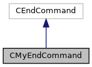

do not remove this div, it is closed by doxygen! 
|  |
| --- |
| NSCL DDAS12.1-001Support for XIA DDAS at FRIB |

 end header part 
 Generated by Doxygen 1.9.1 

 window showing the filter options 

 iframe showing the search results (closed by default)

 top 
[Classes](#nested-classes) |
[Public Member Functions](#pub-methods) |
[Static Protected Member Functions](#pro-static-methods) |
[List of all members](https://github.com/FRIBDAQ/docs/tree/main/ddas-12.1-001/classCMyEndCommand-members.md)

CMyEndCommand Class Reference

header
Provides an end command to override the SBS one.  
 [More...](https://github.com/FRIBDAQ/docs/tree/main/ddas-12.1-001/classCMyEndCommand.md#details)

`#include <CMyEndCommand.h>`

Inheritance diagram for CMyEndCommand:

[[legend](https://github.com/FRIBDAQ/docs/tree/main/ddas-12.1-001/graph_legend.md)]

Collaboration diagram for CMyEndCommand:

[[legend](https://github.com/FRIBDAQ/docs/tree/main/ddas-12.1-001/graph_legend.md)]

|  |  |
| --- | --- |
| Classes |
| struct | EndEvent |
|  | Struct encapsulating the command and Tcl event to end the run.More... |
|  |

|  |  |
| --- | --- |
| Public Member Functions |
|  | CMyEndCommand(CTCLInterpreter &interp,CMyEventSegment*pSeg, CExperiment *pExp) |
|  | Constructor.More... |
|  |
|  | ~CMyEndCommand() |
|  | Destructor.More... |
|  |
| int | transitionToInactive() |
|  |
| int | readOutRemainingData() |
|  |
| int | endRun() |
|  |
| void | rescheduleEndTransition() |
|  |
| void | rescheduleEndRead() |
|  |
| virtual int | operator()(CTCLInterpreter &interp, std::vector< CTCLObject > &objv) |
|  |

|  |  |
| --- | --- |
| Static Protected Member Functions |
| static int | handleEndRun(Tcl_Event *pEvt, int flags) |
|  |
| static int | handleReadOutRemainingData(Tcl_Event *pEvt, int flags) |
|  |

## Detailed Description

Provides an end command to override the SBS one.

## Constructor & Destructor Documentation

## [◆](#a38240db1238d36737488f4efc7d05461)CMyEndCommand()

|  |  |  |  |
| --- | --- | --- | --- |
| CMyEndCommand::CMyEndCommand | ( | CTCLInterpreter & | interp, |
|  |  | CMyEventSegment* | pSeg, |
|  |  | CExperiment * | pExp |
|  | ) |  |  |

Constructor.

- Parameters
  |  |  |
  | --- | --- |
  | interp | Reference to interpreter. |
  | pSeg | Pointer to the event segment to manipulate. |
  | pExp | Pointer to the experiment we're reading data from. |

## [◆](#a2e34053008620bebb9036c38c302e854)~CMyEndCommand()

|  |  |  |  |  |
| --- | --- | --- | --- | --- |
| CMyEndCommand::~CMyEndCommand | ( |  | ) |  |

Destructor.

## Member Function Documentation

## [◆](#a939cf7f6338bfd8e23bd64c33f0a88ba)endRun()

|  |  |  |  |  |
| --- | --- | --- | --- | --- |
| int CMyEndCommand::endRun | ( |  | ) |  |

## [◆](#a09112cd8e5b90d673c99f48e340e46f0)handleEndRun()

|  |  |  |  |  |  |  |  |  |  |  |  |  |  |
| --- | --- | --- | --- | --- | --- | --- | --- | --- | --- | --- | --- | --- | --- |
| int CMyEndCommand::handleEndRun(Tcl_Event *pEvt,intflags) | int CMyEndCommand::handleEndRun | ( | Tcl_Event * | pEvt, |  |  | int | flags |  | ) |  |  | staticprotected |
| int CMyEndCommand::handleEndRun | ( | Tcl_Event * | pEvt, |
|  |  | int | flags |
|  | ) |  |  |

Calls the command's endRun function.

## [◆](#a2cae62d9b4758c30c8ecd0adc8bfcfbd)handleReadOutRemainingData()

|  |  |  |  |  |  |  |  |  |  |  |  |  |  |
| --- | --- | --- | --- | --- | --- | --- | --- | --- | --- | --- | --- | --- | --- |
| int CMyEndCommand::handleReadOutRemainingData(Tcl_Event *pEvt,intflags) | int CMyEndCommand::handleReadOutRemainingData | ( | Tcl_Event * | pEvt, |  |  | int | flags |  | ) |  |  | staticprotected |
| int CMyEndCommand::handleReadOutRemainingData | ( | Tcl_Event * | pEvt, |
|  |  | int | flags |
|  | ) |  |  |

Calls the command's readOutRemainingData function.

## [◆](#ac95ff84701ba86e6889578fd8b61864e)operator()()

|  |  |  |  |  |  |  |  |  |  |  |  |  |  |
| --- | --- | --- | --- | --- | --- | --- | --- | --- | --- | --- | --- | --- | --- |
| int CMyEndCommand::operator()(CTCLInterpreter &interp,std::vector< CTCLObject > &objv) | int CMyEndCommand::operator() | ( | CTCLInterpreter & | interp, |  |  | std::vector< CTCLObject > & | objv |  | ) |  |  | virtual |
| int CMyEndCommand::operator() | ( | CTCLInterpreter & | interp, |
|  |  | std::vector< CTCLObject > & | objv |
|  | ) |  |  |

Overridden CEndCommand function call operator to be sure that our end run gets called at the right time. If an end run operation is permitted, attempt to read out the remaining data and end the run.

## [◆](#ae91a657c0c31fbedc2e05d1e9f15869a)readOutRemainingData()

|  |  |  |  |  |
| --- | --- | --- | --- | --- |
| int CMyEndCommand::readOutRemainingData | ( |  | ) |  |

After reading out the last of the data, write the run statistics to an end-of-run scalers file.

## [◆](#affb0a5fe4e1cd88ae68dd8c1d48acb10)rescheduleEndRead()

|  |  |  |  |  |
| --- | --- | --- | --- | --- |
| void CMyEndCommand::rescheduleEndRead | ( |  | ) |  |

## [◆](#a07ba29ac57de01068bbf65a9fe96fd3d)rescheduleEndTransition()

|  |  |  |  |  |
| --- | --- | --- | --- | --- |
| void CMyEndCommand::rescheduleEndTransition | ( |  | ) |  |

## [◆](#a19de43c3e32ac03b60071e07000de510)transitionToInactive()

|  |  |  |  |  |
| --- | --- | --- | --- | --- |
| int CMyEndCommand::transitionToInactive | ( |  | ) |  |

Stop run in the director module (module #0) – a SYNC interrupt should be generated to stop the run in all modules simultaneously when running synchronously. We are not running synchronously when in INFINITY_CLOCK mode. If the INFINITY_CLOCK mode is set, we must stop the run in each module individually.

- Note
  If the end run signal is successfully communicated to the module(s), the transition to an inactive state cannot fail, only report which module(s) failed to properly end their run. One common cause of this failure is a very high input rate to one or more channels on that module.

---

The documentation for this class was generated from the following files:- [CMyEndCommand.h](https://github.com/FRIBDAQ/docs/tree/main/ddas-12.1-001/CMyEndCommand_8h_source.md)
- [CMyEndCommand.cpp](https://github.com/FRIBDAQ/docs/tree/main/ddas-12.1-001/CMyEndCommand_8cpp.md)

 contents 
 start footer part 

---

Generated by  1.9.1
