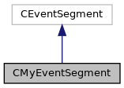

do not remove this div, it is closed by doxygen! 
|  |
| --- |
| NSCL DDAS12.1-001Support for XIA DDAS at FRIB |

 end header part 
 Generated by Doxygen 1.9.1 

 window showing the filter options 

 iframe showing the search results (closed by default)

 top 
[Classes](#nested-classes) |
[Public Member Functions](#pub-methods) |
[[List of all members|https://github.com/FRIBDAQ/docs/tree/main/ddas-12.1-001/classCMyEventSegment-members.md]]

CMyEventSegment Class Reference

header
Derived class for DDAS event segments.  
 [[More...|https://github.com/FRIBDAQ/docs/tree/main/ddas-12.1-001/classCMyEventSegment.md#details]]

`#include <CMyEventSegment.h>`

Inheritance diagram for CMyEventSegment:

[[[legend|https://github.com/FRIBDAQ/docs/tree/main/ddas-12.1-001/graph_legend.md]]]

Collaboration diagram for CMyEventSegment:

[[[legend|https://github.com/FRIBDAQ/docs/tree/main/ddas-12.1-001/graph_legend.md]]]

|  |  |
| --- | --- |
| Public Member Functions |
|  | CMyEventSegment(CMyTrigger*trig, CExperiment &exp) |
|  | Construct from trigger object and experiment.More... |
|  |
|  | CMyEventSegment() |
|  | Default constructor.More... |
|  |
|  | ~CMyEventSegment() |
|  | Destructor.More... |
|  |
| virtual void | initialize() |
|  | Initialize the modules recording data in this segment.More... |
|  |
| virtual size_t | read(void *rBuffer, size_t maxwords) |
|  | Read data from the modules following a valid trigger.More... |
|  |
| virtual void | disable() |
|  | Nothing to disable.More... |
|  |
| virtual void | clear() |
|  | Nothing to clear.More... |
|  |
| virtual void | onBegin() |
|  | Manage run start operation.More... |
|  |
| virtual void | onResume() |
|  | Manage run resume operation.More... |
|  |
| virtual void | onEnd(CExperiment *pExperiment) |
|  | Just return. Sorting is offloaded into its own process.More... |
|  |
| size_t | GetNumberOfModules() |
|  | Get the number of modules in the crate.More... |
|  |
| int | GetCrateID() const |
|  | Get the crate ID value from the configuration.More... |
|  |
| void | synchronize() |
|  | Perform clock synchronization.More... |
|  |
| void | boot(DAQ::DDAS::SystemBooter::BootType=DAQ::DDAS::SystemBooter::FullBoot) |
|  | Load firmware and boot the modules.More... |
|  |
| std::pair< size_t, size_t > | getStatistics() |
|  | Get the cumulative and current run statistics.More... |
|  |

## Detailed Description

Derived class for DDAS event segments.

The event segment reads out a logical chunk of an experiment. In the DDAS case, data from a single crate (single source ID). An experiment may consist of multiple crates arranged in a CCompoundEventSegment container.

## Constructor & Destructor Documentation

## [◆](#ae3c63a527b099640942713010b2afdc5)CMyEventSegment() [1/2]

|  |  |  |  |
| --- | --- | --- | --- |
| CMyEventSegment::CMyEventSegment | ( | CMyTrigger* | trig, |
|  |  | CExperiment & | exp |
|  | ) |  |  |

Construct from trigger object and experiment.

- Parameters
  |  |  |
  | --- | --- |
  | trig | Pointer to the DDAS trigger. |
  | exp | Reference to the experiment the event segment comes from. |

Initialize the system, load the configuration and expected event lengths from the cfgPixie16.txt and modevtlen.txt files, boot the system and initialize the trigger.

In FRIBDAQ 12.0+, the external clock readout is merged into the standard readout framework. The constructor determines whether or not the external clock is enabled for each module the by checking the value of the corresponding bit in the Pixie CSRA register in that module's channel 0.

Failure to properly construct an event segment occurs if:

- The CSRA register cannot be read from channel 0 on any of the modules.
- An custom external timestamp clock calibration is <= 0.
- There are a mix of external and internal clocks enabled on the same crate.
  - **[[Todo:|https://github.com/FRIBDAQ/docs/tree/main/ddas-12.1-001/todo.md#_todo000017]]**
    (ASC 1/25/24): The assumption that the external timestamp bit for channel 0 is the same as the rest of the module allows some obviously bad configurations to be accepted. This *may* be a QtScope issue too: users should be prevented from enabling the external timestamp on a subset of channels if the readout code doesn't support it.

## [◆](#a4edd0f31cb0f21dcb87d34523dcabae7)CMyEventSegment() [2/2]

|  |  |  |  |  |
| --- | --- | --- | --- | --- |
| CMyEventSegment::CMyEventSegment | ( |  | ) |  |

Default constructor.

- Note
  For unit testing purposes only!

## [◆](#a1ebb8549361bda00bcf4fdbde8e95b3b)~CMyEventSegment()

|  |  |  |  |  |
| --- | --- | --- | --- | --- |
| CMyEventSegment::~CMyEventSegment | ( |  | ) |  |

Destructor.

## Member Function Documentation

## [◆](#a5571cb64dea73ace65397665eb33fe6b)boot()

|  |  |  |  |  |  |
| --- | --- | --- | --- | --- | --- |
| void CMyEventSegment::boot | ( | DAQ::DDAS::SystemBooter::BootType | type=DAQ::DDAS::SystemBooter::FullBoot | ) |  |

Load firmware and boot the modules.

- Parameters
  |  |  |
  | --- | --- |
  | type | The boot type (boot mask) passed to the system booter (default = SystemBooter::FullBoot). |

- Exceptions
  |  |  |
  | --- | --- |
  | CDDASException | If the system is initialized and fails to exit before attempting to boot again. |

## [◆](#a82308a0c5aa9475b8b93a107af09a7ed)clear()

|  |  |  |  |  |  |  |
| --- | --- | --- | --- | --- | --- | --- |
| void CMyEventSegment::clear() | void CMyEventSegment::clear | ( |  | ) |  | virtual |
| void CMyEventSegment::clear | ( |  | ) |  |

Nothing to clear.

## [◆](#a2312995c14eab8bc0bcb43c6936c192a)disable()

|  |  |  |  |  |  |  |
| --- | --- | --- | --- | --- | --- | --- |
| void CMyEventSegment::disable() | void CMyEventSegment::disable | ( |  | ) |  | virtual |
| void CMyEventSegment::disable | ( |  | ) |  |

Nothing to disable.

## [◆](#a7b554738d1d50f64f3c6bf903e8e87f2)GetCrateID()

|  |  |  |  |  |
| --- | --- | --- | --- | --- |
| int CMyEventSegment::GetCrateID | ( |  | ) | const |

Get the crate ID value from the configuration.

- Returns
  The crate ID.

## [◆](#a9321893c5fd93985932b6a7925a5e371)GetNumberOfModules()

|  |  |  |  |  |  |  |
| --- | --- | --- | --- | --- | --- | --- |
| size_t CMyEventSegment::GetNumberOfModules() | size_t CMyEventSegment::GetNumberOfModules | ( |  | ) |  | inline |
| size_t CMyEventSegment::GetNumberOfModules | ( |  | ) |  |

Get the number of modules in the crate.

- Returns
  Number of modules.

## [◆](#a575080123e05c7193b4033b164573d53)getStatistics()

|  |  |  |  |  |  |  |
| --- | --- | --- | --- | --- | --- | --- |
| std::pair<size_t, size_t> CMyEventSegment::getStatistics() | std::pair<size_t, size_t> CMyEventSegment::getStatistics | ( |  | ) |  | inline |
| std::pair<size_t, size_t> CMyEventSegment::getStatistics | ( |  | ) |  |

Get the cumulative and current run statistics.

- Returns
  Cumulative and current run stats as a std::pair.

## [◆](#a99e7612c75cfb4989647682f348e9c54)initialize()

|  |  |  |  |  |  |  |
| --- | --- | --- | --- | --- | --- | --- |
| void CMyEventSegment::initialize() | void CMyEventSegment::initialize | ( |  | ) |  | virtual |
| void CMyEventSegment::initialize | ( |  | ) |  |

Initialize the modules recording data in this segment.

Initialize unless there is an INFINITY_CLOCK environment variable with the value "YES" or the firmware has been loaded recently (no system exit).

- Note
  This is not threadsafe as C++ does not require getenv to be thread-safe.

- **[[Todo:|https://github.com/FRIBDAQ/docs/tree/main/ddas-12.1-001/todo.md#_todo000018]]**
  (ASC 1/25/24): An old comment from (I bet) RF: "paging through the global **environ is probably thread-safe however I'm pretty sure at this point in time there's no other thread doing a getenv()."

## [◆](#a2b5c3a694210a002fc8e880c723658bc)onBegin()

|  |  |  |  |  |  |  |
| --- | --- | --- | --- | --- | --- | --- |
| void CMyEventSegment::onBegin() | void CMyEventSegment::onBegin | ( |  | ) |  | virtual |
| void CMyEventSegment::onBegin | ( |  | ) |  |

Manage run start operation.

Begin the list mode run with NEW_RUN (= 1) run mode. If the start fails, display the return value of Pixie16StartListModeRun() and the error code text.

## [◆](#ae7edc9b40909df1ec3b6a00e32e8e9f4)onEnd()

|  |  |  |  |  |  |  |  |
| --- | --- | --- | --- | --- | --- | --- | --- |
| void CMyEventSegment::onEnd(CExperiment *pExperiment) | void CMyEventSegment::onEnd | ( | CExperiment * | pExperiment | ) |  | virtual |
| void CMyEventSegment::onEnd | ( | CExperiment * | pExperiment | ) |  |

Just return. Sorting is offloaded into its own process.

## [◆](#a45441d0d3e68f16a7e36341fed828f33)onResume()

|  |  |  |  |  |  |  |
| --- | --- | --- | --- | --- | --- | --- |
| void CMyEventSegment::onResume() | void CMyEventSegment::onResume | ( |  | ) |  | virtual |
| void CMyEventSegment::onResume | ( |  | ) |  |

Manage run resume operation.

Resume the list mode run with RESUME_RUN (= 0) run mode. If the resume fails, display the return value of Pixie16StartListModeRun and the error code text.

## [◆](#ad3ea387bf91b2e1c4cfdf23f7f7ec408)read()

|  |  |  |  |  |  |  |  |  |  |  |  |  |  |
| --- | --- | --- | --- | --- | --- | --- | --- | --- | --- | --- | --- | --- | --- |
| size_t CMyEventSegment::read(void *rBuffer,size_tmaxBytes) | size_t CMyEventSegment::read | ( | void * | rBuffer, |  |  | size_t | maxBytes |  | ) |  |  | virtual |
| size_t CMyEventSegment::read | ( | void * | rBuffer, |
|  |  | size_t | maxBytes |
|  | ) |  |  |

Read data from the modules following a valid trigger.

- Parameters
  |  |  |  |
  | --- | --- | --- |
  | [in,out] | rBuffer | Read data into this buffer. |
  | [in] | maxBytes | Max bytes of data we can stuff in the buffer. |

- Returns
  Number of 16-bit words in the ring item body.

Pixie has triggered. There are greater than EXTFIFO_READ_THRESH words in the output FIFO of a particular Pixie module. Read out all modules.

This loop finds the first module that has at least one event in it since the trigger fired. We read the minimum of all complete events and the number of complete events that fit in that buffer (note that ) each buffer will also contain the module type word. Note as well that modules count words in uint32_t's but maxBytes is in uint16_t's.

## [◆](#a26f54f7782fe9d27e22480324b0b4c92)synchronize()

|  |  |  |  |  |
| --- | --- | --- | --- | --- |
| void CMyEventSegment::synchronize | ( |  | ) |  |

Perform clock synchronization.

- Exceptions
  |  |  |
  | --- | --- |
  | CDDASException | If we fail to talk properly to the module while setting the clock synchronization parameters. |

More or less straight from the XIA Pixie SDK docs: configure the system to run synchronously through the backplane by setting Pixie module parameters. Synchronous running means that the last module ready to take data starts the run in all modules and the first module to end the run stops the run in all modules (SYNCH_WAIT = 1). In synchronous mode, all run timers are cleared at the start of a new run (IN_SYNCH = 0). Once the run has started, IN_SYNCH is automatically set to 1.

Removed from [[initialize()|https://github.com/FRIBDAQ/docs/tree/main/ddas-12.1-001/classCMyEventSegment.md#a99e7612c75cfb4989647682f348e9c54]] so that this can be called via a command. See the [[CSyncCommand|https://github.com/FRIBDAQ/docs/tree/main/ddas-12.1-001/classCSyncCommand.md]] class for details.

---

The documentation for this class was generated from the following files:- [[CMyEventSegment.h|https://github.com/FRIBDAQ/docs/tree/main/ddas-12.1-001/CMyEventSegment_8h_source.md]]
- [[CMyEventSegment.cpp|https://github.com/FRIBDAQ/docs/tree/main/ddas-12.1-001/CMyEventSegment_8cpp.md]]

 contents 
 start footer part 

---

Generated by  1.9.1
