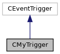

do not remove this div, it is closed by doxygen! 
|  |
| --- |
| NSCL DDAS12.1-001Support for XIA DDAS at FRIB |

 end header part 
 Generated by Doxygen 1.9.1 

 window showing the filter options 

 iframe showing the search results (closed by default)

 top 
[Public Member Functions](#pub-methods) |
[[classCMyTrigger-members]]

CMyTrigger Class Reference

header
Trigger class for DDAS.  
 [[classCMyTrigger#details]]

`#include <CMyTrigger.h>`

Inheritance diagram for CMyTrigger:

[[[graph_legend]]]

Collaboration diagram for CMyTrigger:

[[[graph_legend]]]

|  |  |
| --- | --- |
| Public Member Functions |
|  | CMyTrigger() |
|  | Default constructor.More... |
|  |
|  | ~CMyTrigger() |
|  | Destructor.More... |
|  |
| virtual void | setup() |
|  | Start the trigger timeout.More... |
|  |
| virtual void | teardown() |
|  | Called as data taking ends.More... |
|  |
| virtual bool | operator()() |
|  | operator()More... |
|  |
| virtual void | Initialize(int nummod) |
|  | Setup the trigger and FIFO words array.More... |
|  |
| void | Reset() |
|  | Control for determing if trigger should poll modules or pass control back to CEventSegment for processing the previous block of data.More... |
|  |
| unsigned int * | getWordsInModules() const |
|  | Get the number of words in each module.More... |
|  |

## Detailed Description

Trigger class for DDAS.

A trigger for DDAS systems intended to run inside a polling loop that asks the trigger if it has enough data to read out. The trigger logic is defined in the call operator which triggers a read for a crate of Pixie modules if any module in the crate exceeds its trigger threshold (FIFO threshold value).

## Constructor & Destructor Documentation

## [◆](#ab3a0ffc961b9e7bd1c89a05649daa8df)CMyTrigger()

|  |  |  |  |  |
| --- | --- | --- | --- | --- |
| CMyTrigger::CMyTrigger | ( |  | ) |  |

Default constructor.

If FIFO_THRESHOLD is defined and is a positive integer, it replaces the default value of m_fifoThreshold. The FIFO threshold is the number of 32-bit words that must be in the FIFO for the trigger to fire.

## [◆](#ae707c0d7f054c6f4b500aca7e347785e)~CMyTrigger()

|  |  |  |  |  |
| --- | --- | --- | --- | --- |
| CMyTrigger::~CMyTrigger | ( |  | ) |  |

Destructor.

We need to deallocate memory used to store the FIFO words in each module.

## Member Function Documentation

## [◆](#af8b861e1e309838ff8fbb31d43cfb343)getWordsInModules()

|  |  |  |  |  |  |  |
| --- | --- | --- | --- | --- | --- | --- |
| unsigned int* CMyTrigger::getWordsInModules()const | unsigned int* CMyTrigger::getWordsInModules | ( |  | ) | const | inline |
| unsigned int* CMyTrigger::getWordsInModules | ( |  | ) | const |

Get the number of words in each module.

ReturnsPointer to the array containing the number of words each module has.

## [◆](#ada58ec7c0b8aee0171b5142d790c29b4)Initialize()

|  |  |  |  |  |  |  |  |
| --- | --- | --- | --- | --- | --- | --- | --- |
| void CMyTrigger::Initialize(intnummod) | void CMyTrigger::Initialize | ( | int | nummod | ) |  | virtual |
| void CMyTrigger::Initialize | ( | int | nummod | ) |  |

Setup the trigger and FIFO words array.

Parameters
|  |  |
| --- | --- |
| nummod | The number of installed modules in the Pixie setup. Received from the event segment class. |

Delete and recreate the FIFO words array based on the number of modules.

## [◆](#afc50f0c6df8768b719ec8566654731f8)operator()()

|  |  |  |  |  |  |  |
| --- | --- | --- | --- | --- | --- | --- |
| bool CMyTrigger::operator()() | bool CMyTrigger::operator() | ( |  | ) |  | virtual |
| bool CMyTrigger::operator() | ( |  | ) |  |

operator()

Returnsbool 
Return values
|  |  |
| --- | --- |
| true | Good trigger, pass control back to the event segment. |
| false | Not enough data to trigger. |

Defines the trigger logic. Trigger a read if the number of words in the external FIFO of any Pixie-16 module in a crate exceeds a defined threshold.

- If the module is in the middle of processing a data buffer in the event segment, continue processing the data buffer. Return a true trigger to pass control back the event segment.
- If there are no buffers currently being processed in the event segment look at the Pixie hardware to see if data currently needs to be read out. Do so if the FIFO threshold is exceeded.
- If the trigger has timed out, trigger anyways.

## [◆](#aa7cb649cc7f7dfcf1ec36967f88f4f34)Reset()

|  |  |  |  |  |
| --- | --- | --- | --- | --- |
| void CMyTrigger::Reset | ( |  | ) |  |

Control for determing if trigger should poll modules or pass control back to CEventSegment for processing the previous block of data.

Retrigger: always false.

## [◆](#a359e115dd24af2b2879b4b47d04b11ae)setup()

|  |  |  |  |  |  |  |
| --- | --- | --- | --- | --- | --- | --- |
| void CMyTrigger::setup() | void CMyTrigger::setup | ( |  | ) |  | virtual |
| void CMyTrigger::setup | ( |  | ) |  |

Start the trigger timeout.

## [◆](#ac3eb7d812ea45ad17e7ac1a8db9c6f66)teardown()

|  |  |  |  |  |  |  |
| --- | --- | --- | --- | --- | --- | --- |
| void CMyTrigger::teardown() | void CMyTrigger::teardown | ( |  | ) |  | virtual |
| void CMyTrigger::teardown | ( |  | ) |  |

Called as data taking ends.

DDAS does not need any further signal as data taking end since this function is also called on a pause of data taking on't even think about desyncing modules here.

---

The documentation for this class was generated from the following files:- [[CMyTrigger_8h_source]]
- [[CMyTrigger_8cpp]]

 contents 
 start footer part 

---

Generated by  1.9.1
