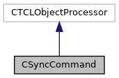

do not remove this div, it is closed by doxygen! 
|  |
| --- |
| NSCL DDAS12.1-001Support for XIA DDAS at FRIB |

 end header part 
 Generated by Doxygen 1.9.1 

 window showing the filter options 

 iframe showing the search results (closed by default)

 top 
[Public Member Functions](#pub-methods) |
[List of all members](https://github.com/FRIBDAQ/docs/tree/main/ddas-12.1-001/classCSyncCommand-members.md)

CSyncCommand Class Reference

header
Provides the ddas_sync command for the ddas readout program.  
 [More...](https://github.com/FRIBDAQ/docs/tree/main/ddas-12.1-001/classCSyncCommand.md#details)

`#include <CSyncCommand.h>`

Inheritance diagram for CSyncCommand:

[[legend](https://github.com/FRIBDAQ/docs/tree/main/ddas-12.1-001/graph_legend.md)]

Collaboration diagram for CSyncCommand:

[[legend](https://github.com/FRIBDAQ/docs/tree/main/ddas-12.1-001/graph_legend.md)]

|  |  |
| --- | --- |
| Public Member Functions |
|  | CSyncCommand(CTCLInterpreter &interp,CMyEventSegment*pSeg) |
|  | Constructor.More... |
|  |
| virtual | ~CSyncCommand() |
|  | Destructor.More... |
|  |
| int | operator()(CTCLInterpreter &interp, std::vector< CTCLObject > &objv) |
|  | Gets control when the command is invoked.More... |
|  |

## Detailed Description

Provides the ddas_sync command for the ddas readout program.

- Construction maintains a pointer to the event segment.
- The class registers the "ddas_sync" command on the main interp.
- When invoked, simply calls the synchronize method of the event segment. - Note
    A more refined approach would be to refuse to perform the operation when the run is in progress. At this time, however we're going to (heaven help us) rely on the user to know that they really need to do a clock synchronization.

## Constructor & Destructor Documentation

## [◆](#a42adbc35a1418add47e48098665055be)CSyncCommand()

|  |  |  |  |
| --- | --- | --- | --- |
| CSyncCommand::CSyncCommand | ( | CTCLInterpreter & | interp, |
|  |  | CMyEventSegment* | pSeg |
|  | ) |  |  |

Constructor.

- Parameters
  |  |  |
  | --- | --- |
  | interp | Reference to the interpreter. |
  | pSeg | Event segment to manipulate. |

Base class registers the command. We need to save the event processor pointer.

## [◆](#ac2696ee814a1cb3e024e2c8c9a6000af)~CSyncCommand()

|  |  |  |  |  |  |  |
| --- | --- | --- | --- | --- | --- | --- |
| CSyncCommand::~CSyncCommand() | CSyncCommand::~CSyncCommand | ( |  | ) |  | virtual |
| CSyncCommand::~CSyncCommand | ( |  | ) |  |

Destructor.

Chain to superclass for now.

## Member Function Documentation

## [◆](#aa64fc2bc631ee8394a6434c816fd10ca)operator()()

|  |  |  |  |
| --- | --- | --- | --- |
| int CSyncCommand::operator() | ( | CTCLInterpreter & | interp, |
|  |  | std::vector< CTCLObject > & | objv |
|  | ) |  |  |

Gets control when the command is invoked.

- Parameters
  |  |  |
  | --- | --- |
  | interp | Intepreter that is running this command. |
  | objv | Words that make up the tcl command. |

- Returns
  Command status.

- Return values
  |  |  |
  | --- | --- |
  | TCL_OK | Success. |
  | TCL_ERROR | Failure. |

- Ensure there are no more parameters.
- Invoke the event segment's synchronize method.

---

The documentation for this class was generated from the following files:- [CSyncCommand.h](https://github.com/FRIBDAQ/docs/tree/main/ddas-12.1-001/CSyncCommand_8h_source.md)
- [CSyncCommand.cpp](https://github.com/FRIBDAQ/docs/tree/main/ddas-12.1-001/CSyncCommand_8cpp.md)

 contents 
 start footer part 

---

Generated by  1.9.1
