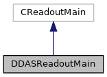

do not remove this div, it is closed by doxygen! 
|  |
| --- |
| NSCL DDAS12.1-001Support for XIA DDAS at FRIB |

 end header part 
 Generated by Doxygen 1.9.1 

 window showing the filter options 

 iframe showing the search results (closed by default)

 top 
[Public Member Functions](#pub-methods) |
[[List of all members|https://github.com/FRIBDAQ/docs/tree/main/ddas-12.1-001/classDDASReadoutMain-members.md]]

DDASReadoutMain Class Reference

header
Production readout class for DDAS systems.  
 [[More...|https://github.com/FRIBDAQ/docs/tree/main/ddas-12.1-001/classDDASReadoutMain.md#details]]

`#include <DDASReadoutMain.h>`

Inheritance diagram for DDASReadoutMain:

[[[legend|https://github.com/FRIBDAQ/docs/tree/main/ddas-12.1-001/graph_legend.md]]]

Collaboration diagram for DDASReadoutMain:

[[[legend|https://github.com/FRIBDAQ/docs/tree/main/ddas-12.1-001/graph_legend.md]]]

|  |  |
| --- | --- |
| Public Member Functions |
| virtual void | SetupReadout(CExperiment *pExperiment) |
|  | Setup the Readout.More... |
|  |
| virtual void | SetupScalers(CExperiment *pExperiment) |
|  | Setup the scaler Readout.More... |
|  |
| virtual void | addCommands(CTCLInterpreter *pInterp) |
|  | Used to add Tcl commands. See the CTCLObjectProcessor class.More... |
|  |
| virtual void | SetupRunVariables(CTCLInterpreter *pInterp) |
|  | Setup run variables.More... |
|  |
| virtual void | SetupStateVariables(CTCLInterpreter *pInterp) |
|  | Setup state variables.More... |
|  |

## Detailed Description

Production readout class for DDAS systems.

[[DDASReadoutMain|https://github.com/FRIBDAQ/docs/tree/main/ddas-12.1-001/classDDASReadoutMain.md]] is the 'application' class for the production readout software for DDAS systems i.e. systems utilizing XIA digitizer modules. The application class has overridden and implemented several member functions from the CReadoutMain base class for use in this application.

These are:

- AddCommands : Extend the Tcl interpreter with additional commands.
- SetupRunVariables : Creates an initial set of run variables.
- SetupStateVariables : Creates an initial set of state variables.
- SetupReadout : Sets up the software's trigger and its response to that trigger.
- SetupScalers : Sets up the response to the scaler trigger and, if desired, modifies the scaler trigger from a periodic trigger controlled by the 'frequency' Tcl variable to something else.

For more information about how to tailor this code, see the SBS readout CReadoutMain and Skeleton classes.

## Member Function Documentation

## [◆](#aac788b9d7f37d4d64683ca810861f3bc)addCommands()

|  |  |  |  |  |  |  |  |
| --- | --- | --- | --- | --- | --- | --- | --- |
| void DDASReadoutMain::addCommands(CTCLInterpreter *pInterp) | void DDASReadoutMain::addCommands | ( | CTCLInterpreter * | pInterp | ) |  | virtual |
| void DDASReadoutMain::addCommands | ( | CTCLInterpreter * | pInterp | ) |  |

Used to add Tcl commands. See the CTCLObjectProcessor class.

- Parameters
  |  |  |
  | --- | --- |
  | pInterp | Pointer to CTCLInterpreter object that encapsulates the Tcl_Interp* of our main interpreter. |

Register the statistics command in addition to all the usual stuff from the base class.

## [◆](#ab5b601d4fd5a87735fba02149c549d55)SetupReadout()

|  |  |  |  |  |  |  |  |
| --- | --- | --- | --- | --- | --- | --- | --- |
| void DDASReadoutMain::SetupReadout(CExperiment *pExperiment) | void DDASReadoutMain::SetupReadout | ( | CExperiment * | pExperiment | ) |  | virtual |
| void DDASReadoutMain::SetupReadout | ( | CExperiment * | pExperiment | ) |  |

Setup the Readout.

- Parameters
  |  |  |
  | --- | --- |
  | pExperiment | Pointer to the experiment object. |

This function must define the trigger as well as the response of the program to triggers. A trigger is an object that describes when an event happens. Triggers are objects derived from CEventTrigger. In this case we use the [[CMyTrigger|https://github.com/FRIBDAQ/docs/tree/main/ddas-12.1-001/classCMyTrigger.md]] class to define the trigger object.

- Note
  This function is incompatible with the pre-10.0 software in that for the 10.0 software, there was a default trigger that did useful stuff. The default trigger for this version is a NULL trigger (a trigger that never happens). You *must* create a trigger object and register it with the experiment object via its EstablishTrigger member funtion else you'll never get any events.

## [◆](#a30e365f2ed0910727a37d2210196b2ad)SetupRunVariables()

|  |  |  |  |  |  |  |  |
| --- | --- | --- | --- | --- | --- | --- | --- |
| void DDASReadoutMain::SetupRunVariables(CTCLInterpreter *pInterp) | void DDASReadoutMain::SetupRunVariables | ( | CTCLInterpreter * | pInterp | ) |  | virtual |
| void DDASReadoutMain::SetupRunVariables | ( | CTCLInterpreter * | pInterp | ) |  |

Setup run variables.

- Parameters
  |  |  |
  | --- | --- |
  | pInterp | Pointer to CTCLInterpreter object that encapsulates the Tcl_Interp* of our main interpreter. |

A run variable is a Tcl variable whose value is periodically written to the output event stream. Run variables are intended to monitor things that can change in the middle of a run.

- Note
  The base class may create run variables so see the comments in the function body about where to add code.

See also: SetupStateVariables

## [◆](#a7a92356d7d50e48b4df50bcc4a94b86f)SetupScalers()

|  |  |  |  |  |  |  |  |
| --- | --- | --- | --- | --- | --- | --- | --- |
| void DDASReadoutMain::SetupScalers(CExperiment *pExperiment) | void DDASReadoutMain::SetupScalers | ( | CExperiment * | pExperiment | ) |  | virtual |
| void DDASReadoutMain::SetupScalers | ( | CExperiment * | pExperiment | ) |  |

Setup the scaler Readout.

- Parameters
  |  |  |
  | --- | --- |
  | pExperiment | Pointer to the experiment object. |

We simply use a timed trigger to read out scaler data at regular intervals. By default the scaler read interval is 16 seconds. This can be overridden using the environment variable `SCALER_SECONDS` or by specifying a value using the `-scalerseconds` option when invoking this program with `ddasReadout`.

## [◆](#ab43867a7009e1ab68f0e8f2f34d6e1c0)SetupStateVariables()

|  |  |  |  |  |  |  |  |
| --- | --- | --- | --- | --- | --- | --- | --- |
| void DDASReadoutMain::SetupStateVariables(CTCLInterpreter *pInterp) | void DDASReadoutMain::SetupStateVariables | ( | CTCLInterpreter * | pInterp | ) |  | virtual |
| void DDASReadoutMain::SetupStateVariables | ( | CTCLInterpreter * | pInterp | ) |  |

Setup state variables.

- Parameters
  |  |  |
  | --- | --- |
  | pInterp | Pointer to CTCLInterpreter object that encapsulates the Tcl_Interp* of our main interpreter. |

A state variable is a Tcl variable whose value is logged whenever the run transitions to active. While the run is not halted, state variables are write protected. State variables are intended to log a property of the run. Examples of state variables created by the production readout framework are run and title which hold the run number, and the title.

- Note
  The base class may create state variables so see the comments in the function body about where to add code.

See also: SetupRunVariables

---

The documentation for this class was generated from the following files:- [[DDASReadoutMain.h|https://github.com/FRIBDAQ/docs/tree/main/ddas-12.1-001/DDASReadoutMain_8h_source.md]]
- [[DDASReadoutMain.cpp|https://github.com/FRIBDAQ/docs/tree/main/ddas-12.1-001/DDASReadoutMain_8cpp.md]]

 contents 
 start footer part 

---

Generated by  1.9.1
