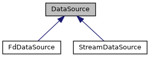

do not remove this div, it is closed by doxygen! 
|  |
| --- |
| NSCL DDAS12.1-001Support for XIA DDAS at FRIB |

 end header part 
 Generated by Doxygen 1.9.1 

 window showing the filter options 

 iframe showing the search results (closed by default)

 top 
[Public Member Functions](#pub-methods) |
[Protected Attributes](#pro-attribs) |
[[List of all members|classDataSource-members]]

DataSource Class Referenceabstract

header
Abstract base class for DDAS data sources.  
 [[More...|classDataSource#details]]

`#include <DataSource.h>`

Inheritance diagram for DataSource:

[[[legend|graph_legend]]]

|  |  |
| --- | --- |
| Public Member Functions |
|  | DataSource(RingItemFactoryBase *pFactory) |
|  | Constructor.More... |
|  |
| virtual | ~DataSource() |
|  | Destructor.More... |
|  |
| virtual CRingItem * | getItem()=0 |
|  | Pure-virtual method to access a ring item from the data source. Must be implemented in derived classes.More... |
|  |
| void | setFactory(RingItemFactoryBase *pFactory) |
|  | Set a new factory.More... |
|  |

|  |  |
| --- | --- |
| Protected Attributes |
| RingItemFactoryBase * | m_pFactory |
|  | Pointer to our ring item factory.More... |
|  |

## Detailed Description

Abstract base class for DDAS data sources.

Pure abstract data source which uses a factory's ring item getters to provide ring items from a data source. Since the factory provides this, we'll need concrete classes:

- [[FdDataSource|classFdDataSource]]: give data from a file descriptor.
- [[StreamDataSource|classStreamDataSource]]: give data from a stream. - Note
    Neither of these data sources supports reading directly from a ring buffer, as the format library is unaware of those NSCLDAQ classes. To read data from a ringbuffer you can create a file descriptor data source and read data from stdin i.e. `ringselector | ddasdumper -`.

## Constructor & Destructor Documentation

## [◆](#a0e6fb091ec780aa0a0dcdb30a9773533)DataSource()

|  |  |  |  |  |  |
| --- | --- | --- | --- | --- | --- |
| DataSource::DataSource | ( | RingItemFactoryBase * | pFactory | ) |  |

Constructor.

Just saves the factory pointer - note that we gain ownershp of the factory and, therefore, it's deleted on our destruction.

## [◆](#a01b7c981a55b10889f23b300d2273656)~DataSource()

|  |  |  |  |  |  |  |
| --- | --- | --- | --- | --- | --- | --- |
| DataSource::~DataSource() | DataSource::~DataSource | ( |  | ) |  | virtual |
| DataSource::~DataSource | ( |  | ) |  |

Destructor.

Destroys the factory.

## Member Function Documentation

## [◆](#aa4b5176de8aa706b8c02e161e290ed24)getItem()

|  |  |  |  |  |  |  |
| --- | --- | --- | --- | --- | --- | --- |
| virtual CRingItem* DataSource::getItem() | virtual CRingItem* DataSource::getItem | ( |  | ) |  | pure virtual |
| virtual CRingItem* DataSource::getItem | ( |  | ) |  |

Pure-virtual method to access a ring item from the data source. Must be implemented in derived classes.

- Returns
  Pointer to the next ring item from the source.

Implemented in [[StreamDataSource|classStreamDataSource#a02bf519172132c894990cf9af7b1f83d]], and [[FdDataSource|classFdDataSource#a798fb79377ecc62786e54e2fe74c1c03]].

## [◆](#a6480bdb02e863710e5ff73ab32e94496)setFactory()

|  |  |  |  |  |  |
| --- | --- | --- | --- | --- | --- |
| void DataSource::setFactory | ( | RingItemFactoryBase * | pFactory | ) |  |

Set a new factory.

Pretty simple:

- Delete the current factory.
- Set a new factory e.g. if the format changes.

## Member Data Documentation

## [◆](#a6f0912454e4f3444260ed98272d3b7d5)m_pFactory

|  |  |  |
| --- | --- | --- |
| RingItemFactoryBase* DataSource::m_pFactory | RingItemFactoryBase* DataSource::m_pFactory | protected |
| RingItemFactoryBase* DataSource::m_pFactory |

Pointer to our ring item factory.

---

The documentation for this class was generated from the following files:- [[DataSource.h|DataSource_8h_source]]
- [[DataSource.cpp|DataSource_8cpp]]

 contents 
 start footer part 

---

Generated by  1.9.1
