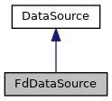

do not remove this div, it is closed by doxygen! 
|  |
| --- |
| NSCL DDAS12.1-001Support for XIA DDAS at FRIB |

 end header part 
 Generated by Doxygen 1.9.1 

 window showing the filter options 

 iframe showing the search results (closed by default)

 top 
[Public Member Functions](#pub-methods) |
[[List of all members|https://github.com/FRIBDAQ/docs/tree/main/ddas-12.1-001/classFdDataSource-members.md]]

FdDataSource Class Reference

header
A class taking the file descriptor as a data source. Most commonly used to construct a data source from stdin.  
 [[More...|https://github.com/FRIBDAQ/docs/tree/main/ddas-12.1-001/classFdDataSource.md#details]]

`#include <FdDataSource.h>`

Inheritance diagram for FdDataSource:

[[[legend|https://github.com/FRIBDAQ/docs/tree/main/ddas-12.1-001/graph_legend.md]]]

Collaboration diagram for FdDataSource:

[[[legend|https://github.com/FRIBDAQ/docs/tree/main/ddas-12.1-001/graph_legend.md]]]

|  |  |
| --- | --- |
| Public Member Functions |
|  | FdDataSource(RingItemFactoryBase *pFactory, int fd) |
|  | Constructor.More... |
|  |
| virtual | ~FdDataSource() |
|  | Destructor.More... |
|  |
| virtual CRingItem * | getItem() |
|  | Get a ring item from the soruce. Implementation of the mandatory interface from the base class.More... |
|  |
| Public Member Functions inherited fromDataSource |
|  | DataSource(RingItemFactoryBase *pFactory) |
|  | Constructor.More... |
|  |
| virtual | ~DataSource() |
|  | Destructor.More... |
|  |
| void | setFactory(RingItemFactoryBase *pFactory) |
|  | Set a new factory.More... |
|  |

|  |  |
| --- | --- |
| Additional Inherited Members |
| Protected Attributes inherited fromDataSource |
| RingItemFactoryBase * | m_pFactory |
|  | Pointer to our ring item factory.More... |
|  |

## Detailed Description

A class taking the file descriptor as a data source. Most commonly used to construct a data source from stdin.

## Constructor & Destructor Documentation

## [◆](#a947ad23ce26c16dc3d8065ba994afa76)FdDataSource()

|  |  |  |  |
| --- | --- | --- | --- |
| FdDataSource::FdDataSource | ( | RingItemFactoryBase * | pFactory, |
|  |  | int | fd |
|  | ) |  |  |

Constructor.

- Parameters
  |  |  |
  | --- | --- |
  | pFactory | Pointer to the factory used to get items. |
  | fd | File descriptor open on the data source. The caller owns this, we don't close it on destruction. |

## [◆](#a5e0b15340e1cefd66351372843cd78ff)~FdDataSource()

|  |  |  |  |  |  |  |
| --- | --- | --- | --- | --- | --- | --- |
| FdDataSource::~FdDataSource() | FdDataSource::~FdDataSource | ( |  | ) |  | virtual |
| FdDataSource::~FdDataSource | ( |  | ) |  |

Destructor.

## Member Function Documentation

## [◆](#a798fb79377ecc62786e54e2fe74c1c03)getItem()

|  |  |  |  |  |  |  |
| --- | --- | --- | --- | --- | --- | --- |
| CRingItem * FdDataSource::getItem() | CRingItem * FdDataSource::getItem | ( |  | ) |  | virtual |
| CRingItem * FdDataSource::getItem | ( |  | ) |  |

Get a ring item from the soruce. Implementation of the mandatory interface from the base class.

- Returns
  Pointer to the next ring item from the stream.

- Return values
  |  |  |
  | --- | --- |
  | nullptr | If none. |

Implements [[DataSource|https://github.com/FRIBDAQ/docs/tree/main/ddas-12.1-001/classDataSource.md#aa4b5176de8aa706b8c02e161e290ed24]].

---

The documentation for this class was generated from the following files:- [[FdDataSource.h|https://github.com/FRIBDAQ/docs/tree/main/ddas-12.1-001/FdDataSource_8h_source.md]]
- [[FdDataSource.cpp|https://github.com/FRIBDAQ/docs/tree/main/ddas-12.1-001/FdDataSource_8cpp.md]]

 contents 
 start footer part 

---

Generated by  1.9.1
