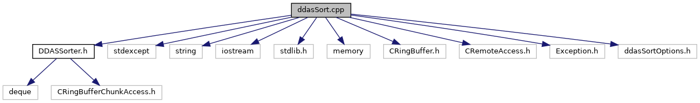

do not remove this div, it is closed by doxygen! 
|  |
| --- |
| NSCL DDAS12.1-001Support for XIA DDAS at FRIB |

 end header part 
 Generated by Doxygen 1.9.1 

 window showing the filter options 

 iframe showing the search results (closed by default) 

- [[ddas|dir_6514a8425036055b37d1cc9ce7dc44e6]]
- [[readout|dir_9ad3e8fcfa94677d694c5b48d5640f86]]

 top 
[Functions](#func-members)

ddasSort.cpp File Reference

header
Main program to sort DDAS hits.  
[More...](#details)

`#include "DDASSorter.h"`  

`#include <stdexcept>`  

`#include <string>`  

`#include <iostream>`  

`#include <stdlib.h>`  

`#include <memory>`  

`#include <CRingBuffer.h>`  

`#include <CRemoteAccess.h>`  

`#include <Exception.h>`  

`#include "ddasSortOptions.h"`

Include dependency graph for ddasSort.cpp:

|  |  |
| --- | --- |
| Functions |
| int | main(int argc, char **argv) |
|  | Entry point to the sorter: process comand line arguments, instantiates and invokes the application class with appropriate parameters.More... |
|  |

## Detailed Description

Main program to sort DDAS hits.

## Function Documentation

## [◆](#a3c04138a5bfe5d72780bb7e82a18e627)main()

|  |  |  |  |
| --- | --- | --- | --- |
| int main | ( | int | argc, |
|  |  | char ** | argv |
|  | ) |  |  |

Entry point to the sorter: process comand line arguments, instantiates and invokes the application class with appropriate parameters.

In order to get best performance from [[DDASReadout|namespaceDDASReadout]], sorting of the resulting hits has been pushed downstream. This program reads ring items that consist of multiple hits from boards and outputs ring items that consist of single hits from all boards in an experiment sorted by time. Ring item bodies we take as input look like:

+---------------------------------------------------—+ | Size of the body in 16 bit words (uint32_t) | +---------------------------------------------------—+ | Module ID uint32_t (note bit 21 says use ext clock) | +---------------------------------------------------—+ | Clock scale factor (double precision) | +---------------------------------------------------—+ | Hit 1, Hit 2, ... | | ... |

**[[Todo:|todo#_todo000019]]**(ASC 3/18/24): Sometimes the sorter fails to create its sort ring. In my attempts to resurrect the sorter tests, I had some issues making multiple `createAndProduce` calls from within the same function. Here it had better be making that call only once. Is this more reliable if I call `CRingBuffer::create()` and `new CRingBuffer()` similar to whats done in sortertests.cpp?

 contents 
 start footer part 

---

Generated by  1.9.1
