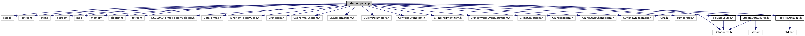

do not remove this div, it is closed by doxygen! 
|  |
| --- |
| NSCL DDAS12.1-001Support for XIA DDAS at FRIB |

 end header part 
 Generated by Doxygen 1.9.1 

 window showing the filter options 

 iframe showing the search results (closed by default) 

- [ddas](https://github.com/FRIBDAQ/docs/tree/main/ddas-12.1-001/dir_6514a8425036055b37d1cc9ce7dc44e6.md)
- [ddasdumper](https://github.com/FRIBDAQ/docs/tree/main/ddas-12.1-001/dir_3bbf1c6b836d16f0cd5f6a50630f820c.md)

 top 
[Functions](#func-members)

ddasdumper.cpp File Reference

header
Main program to use the format library to dump DDAS event files. Based on the unified format library evtdump example code.  
[More...](#details)

`#include <cstdlib>`  

`#include <iostream>`  

`#include <string>`  

`#include <sstream>`  

`#include <map>`  

`#include <memory>`  

`#include <algorithm>`  

`#include <fstream>`  

`#include <NSCLDAQFormatFactorySelector.h>`  

`#include <DataFormat.h>`  

`#include <RingItemFactoryBase.h>`  

`#include <CRingItem.h>`  

`#include <CAbnormalEndItem.h>`  

`#include <CDataFormatItem.h>`  

`#include <CGlomParameters.h>`  

`#include <CPhysicsEventItem.h>`  

`#include <CRingFragmentItem.h>`  

`#include <CRingPhysicsEventCountItem.h>`  

`#include <CRingScalerItem.h>`  

`#include <CRingTextItem.h>`  

`#include <CRingStateChangeItem.h>`  

`#include <CUnknownFragment.h>`  

`#include <URL.h>`  

`#include "dumperargs.h"`  

`#include "DataSource.h"`  

`#include "FdDataSource.h"`  

`#include "StreamDataSource.h"`  

`#include "RootFileDataSink.h"`

Include dependency graph for ddasdumper.cpp:

|  |  |
| --- | --- |
| Functions |
| std::vector< uint32_t > | makeExclusionList(const std::string &exclusions) |
|  | Creates a vector of the ring item types to be excluded from the dump given a comma separated list of types.More... |
|  |
| DataSource* | makeDataSource(::ufmt::RingItemFactoryBase *pFactory, const std::string &strUrl) |
|  | Parse the URI of the source and based on the parse create the underlying connection. Create the correct concrete instance ofDataSourcegiven all that.More... |
|  |
| int | main(int argc, char *argv[]) |
|  | Setup, configure dumper settings and dump events.More... |
|  |

## Detailed Description

Main program to use the format library to dump DDAS event files. Based on the unified format library evtdump example code.

## Function Documentation

## [◆](#a0ddf1224851353fc92bfbff6f499fa97)main()

|  |  |  |  |
| --- | --- | --- | --- |
| int main | ( | int | argc, |
|  |  | char * | argv[] |
|  | ) |  |  |

Setup, configure dumper settings and dump events.

- Parameters
  |  |  |
  | --- | --- |
  | argc,argv | Argument count and argument vector. |

- Returns
  EXIT_SUCCESS Successful event dump

- Note
  All handled exceptions cause immidiate termination via `std::exit(EXIT_FAILURE)`.

## [◆](#a8dab76f159e268547ead83216ab6e295)makeDataSource()

|  |  |  |  |
| --- | --- | --- | --- |
| DataSource* makeDataSource | ( | ::ufmt::RingItemFactoryBase * | pFactory, |
|  |  | const std::string & | strUrl |
|  | ) |  |  |

Parse the URI of the source and based on the parse create the underlying connection. Create the correct concrete instance of [DataSource](https://github.com/FRIBDAQ/docs/tree/main/ddas-12.1-001/classDataSource.md) given all that.

- Parameters
  |  |  |
  | --- | --- |
  | pFactory | Pointer to the ring item factory to use. |
  | strUrl | String URI of the connection. |

- Exceptions
  |  |  |
  | --- | --- |
  | std::invalid_argument | If a ringbuffer data source is requested. The unified format library is incorporated into the NSCLDAQ, but does not have NSCLDAQ support enabled as its installed first. |

- Returns
  Dynamically allocated data source.

## [◆](#a2fe49a6278b9dd751b7de9a28cc084ec)makeExclusionList()

|  |  |  |  |  |  |
| --- | --- | --- | --- | --- | --- |
| std::vector<uint32_t> makeExclusionList | ( | const std::string & | exclusions | ) |  |

Creates a vector of the ring item types to be excluded from the dump given a comma separated list of types.

- Parameters
  |  |  |
  | --- | --- |
  | exclusions | - string containing the exclusion list. |

- Exceptions
  |  |  |
  | --- | --- |
  | std::invalid_argument | an exclusion item is not a string and is not in the map of recognized item types. |

- Returns
  Vector of items to exclude.

A type can be a string or a positive number. If it is a string, it is translated to the type id using TypeMap. If it is a number, it is used as is.

 contents 
 start footer part 

---

Generated by  1.9.1
