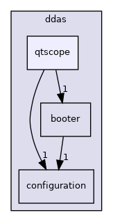

do not remove this div, it is closed by doxygen! 
|  |
| --- |
| NSCL DDAS12.1-001Support for XIA DDAS at FRIB |

 end header part 
 Generated by Doxygen 1.9.1 

 window showing the filter options 

 iframe showing the search results (closed by default) 

- [[ddas|https://github.com/FRIBDAQ/docs/tree/main/ddas-12.1-001/dir_6514a8425036055b37d1cc9ce7dc44e6.md]]
- [[qtscope|https://github.com/FRIBDAQ/docs/tree/main/ddas-12.1-001/dir_9334a42c99d1a98f3e5901fa69a667c5.md]]

 top 
qtscope Directory Reference

header
Directory dependency graph for qtscope:

|  |  |
| --- | --- |
| Files |
| file | CDataGenerator.cpp |
|  | Implementation of the offline data generation class. |
|  |
| file | CDataGenerator.h[code] |
|  | Defines a class for generating offline data for testing/debugging and a ctypes interface for the class. |
|  |
| file | CPixieDSPUtilities.cpp |
|  | Implementation DSP utilities class. |
|  |
| file | CPixieDSPUtilities.h[code] |
|  | Defines a class to read and write settings to XIA Pixie modules and a ctypes interface for the class. |
|  |
| file | CPixieRunUtilities.cpp |
|  | Implementation of the run utilities class. |
|  |
| file | CPixieRunUtilities.h[code] |
|  | Defines a class for managing list-mode and baseline runs and a ctypes interface for the class. |
|  |
| file | CPixieSystemUtilities.cpp |
|  | Implementation the PixieDAQsystem utilities class. |
|  |
| file | CPixieSystemUtilities.h[code] |
|  | Defines a class for managing the state of PixieDAQsystems and a ctypes interface for the class. |
|  |
| file | CPixieTraceUtilities.cpp |
|  | Implementation of the trace utilities class. |
|  |
| file | CPixieTraceUtilities.h[code] |
|  | Defines a class for trace management and a ctypes interface for the class. |
|  |
| file | qtscope.cpp |
|  | QtScope main. |
|  |

 contents 
 start footer part 

---

Generated by  1.9.1
