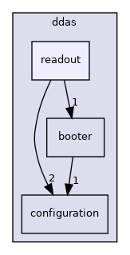

do not remove this div, it is closed by doxygen! 
|  |
| --- |
| NSCL DDAS12.1-001Support for XIA DDAS at FRIB |

 end header part 
 Generated by Doxygen 1.9.1 

 window showing the filter options 

 iframe showing the search results (closed by default) 

- [[ddas|dir_6514a8425036055b37d1cc9ce7dc44e6]]
- [[readout|dir_9ad3e8fcfa94677d694c5b48d5640f86]]

 top 
readout Directory Reference

header
Directory dependency graph for readout:

|  |  |
| --- | --- |
| Files |
| file | BufferArena.cpp |
|  | Implement the buffer arena class. |
|  |
| file | BufferArena.h[code] |
|  | Manager for a set of ReferenceCountedBuffer objects. |
|  |
| file | CBootCommand.cpp |
|  | Implement the ddasboot command. |
|  |
| file | CBootCommand.h[code] |
|  | Class definition for the ddasboot command. |
|  |
| file | CDDASStatisticsCommand.cpp |
|  | Implement the statistics command specific toDDASReadout. |
|  |
| file | CDDASStatisticsCommand.h[code] |
|  | Provide DDAS specific 'statistics' command for getting statistics. |
|  |
| file | CMyBusy.cpp |
|  | Implement a busy class for DDAS. Entirely No-ops. |
|  |
| file | CMyBusy.h[code] |
|  | Define a busy class for DDAS. |
|  |
| file | CMyEndCommand.cpp |
|  | Implement the end run command. |
|  |
| file | CMyEndCommand.h[code] |
|  | Define the end run command. |
|  |
| file | CMyEventSegment.cpp |
|  | Implementation of the event segment class for DDAS systems. |
|  |
| file | CMyEventSegment.h[code] |
|  | Define a DDAS event segment. |
|  |
| file | CMyScaler.cpp |
|  | Implement the DDAS scaler class. |
|  |
| file | CMyScaler.h[code] |
|  | Define the DDAS scaler class. |
|  |
| file | CMyTrigger.cpp |
|  | Implement the DDAS trigger. |
|  |
| file | CMyTrigger.h[code] |
|  | Define a trigger class for DDAS. |
|  |
| file | CSyncCommand.cpp |
|  | Implement the ddas_sync command. |
|  |
| file | CSyncCommand.h[code] |
|  | Header for class that implements the ddas_sync command. |
|  |
| file | ddasReadout.tcl |
|  |
| file | DDASReadoutMain.cpp |
|  | Implementation of the production DDAS readout code. |
|  |
| file | DDASReadoutMain.h[code] |
|  | Defines the production readout software for DDAS systems using NSCLDAQ 10.0 and later. |
|  |
| file | ddasSort.cpp |
|  | Main program to sort DDAS hits. |
|  |
| file | DDASSorter.cpp |
|  | Implement the timestamp sorting code. |
|  |
| file | DDASSorter.h[code] |
|  | Define the class that does all the timestamp sorting. |
|  |
| file | HitManager.cpp |
|  | Implements the CHitManager class. |
|  |
| file | HitManager.h[code] |
|  | Defines a class to collect and sort hits from modules and outputs hits within a specified time window. |
|  |
| file | RawChannel.cpp |
|  | Implement the raw channel hit storage struct. |
|  |
| file | RawChannel.h[code] |
|  | Defines a raw channel hit storage struct for Readout/sorting. |
|  |
| file | ReferenceCountedBuffer.cpp |
|  | Implement the reference counted buffer object. |
|  |
| file | ReferenceCountedBuffer.h[code] |
|  | Provides a reference counted buffer. |
|  |
| file | ZeroCopyHit.cpp |
|  | Implement the ZeroCopyHit class. See header comments. |
|  |
| file | ZeroCopyHit.h[code] |
|  | Class to manage a zero copy RawChannel that comes from inside a buffer from a buffer arena. |
|  |

 contents 
 start footer part 

---

Generated by  1.9.1
