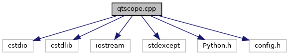

do not remove this div, it is closed by doxygen! 
|  |
| --- |
| NSCL DDAS12.1-001Support for XIA DDAS at FRIB |

 end header part 
 Generated by Doxygen 1.9.1 

 window showing the filter options 

 iframe showing the search results (closed by default) 

- [[ddas|dir_6514a8425036055b37d1cc9ce7dc44e6]]
- [[qtscope|dir_9334a42c99d1a98f3e5901fa69a667c5]]

 top 
[Functions](#func-members)

qtscope.cpp File Reference

header
QtScope main.  
[More...](#details)

`#include <cstdio>`  

`#include <cstdlib>`  

`#include <iostream>`  

`#include <stdexcept>`  

`#include <Python.h>`  

`#include <config.h>`

Include dependency graph for qtscope.cpp:

|  |  |
| --- | --- |
| Functions |
| int | main(int argc, char *argv[]) |
|  | QtScope main.More... |
|  |

## Detailed Description

QtScope main.

## Function Documentation

## [◆](#a0ddf1224851353fc92bfbff6f499fa97)main()

|  |  |  |  |
| --- | --- | --- | --- |
| int main | ( | int | argc, |
|  |  | char * | argv[] |
|  | ) |  |  |

QtScope main.

Parameters
|  |  |
| --- | --- |
| argc | Number of command line options. |
| argv | The command line options. |

Returnsint 
Return values
|  |  |
| --- | --- |
| 0 | Success. |

Uses Python C++ API to call main.py to configure and run QtScope.

 contents 
 start footer part 

---

Generated by  1.9.1
