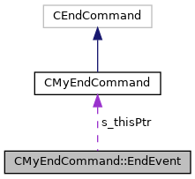

do not remove this div, it is closed by doxygen! 
|  |
| --- |
| NSCL DDAS12.1-001Support for XIA DDAS at FRIB |

 end header part 
 Generated by Doxygen 1.9.1 

 window showing the filter options 

 iframe showing the search results (closed by default) 

- [[CMyEndCommand|classCMyEndCommand]]
- [[EndEvent|structCMyEndCommand_1_1EndEvent]]

 top 
[Public Attributes](#pub-attribs) |
[[List of all members|structCMyEndCommand_1_1EndEvent-members]]

CMyEndCommand::EndEvent Struct Reference

header
Struct encapsulating the command and Tcl event to end the run.  
 [[More...|structCMyEndCommand_1_1EndEvent#details]]

`#include <CMyEndCommand.h>`

Collaboration diagram for CMyEndCommand::EndEvent:

[[[legend|graph_legend]]]

|  |  |
| --- | --- |
| Public Attributes |
| Tcl_Event | s_rawEvent |
|  | Generic event for the Tcl event system.More... |
|  |
| CMyEndCommand* | s_thisPtr |
|  | Pointer to this command.More... |
|  |

## Detailed Description

Struct encapsulating the command and Tcl event to end the run.

## Member Data Documentation

## [◆](#a2dc48a2e258de03ae8102782cc514c73)s_rawEvent

|  |
| --- |
| Tcl_Event CMyEndCommand::EndEvent::s_rawEvent |

Generic event for the Tcl event system.

## [◆](#a23f8d23c227b70a8b7a5e58dcc80fa10)s_thisPtr

|  |
| --- |
| CMyEndCommand* CMyEndCommand::EndEvent::s_thisPtr |

Pointer to this command.

---

The documentation for this struct was generated from the following file:- [[CMyEndCommand.h|CMyEndCommand_8h_source]]

 contents 
 start footer part 

---

Generated by  1.9.1
