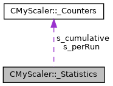

do not remove this div, it is closed by doxygen! 
|  |
| --- |
| NSCL DDAS12.1-001Support for XIA DDAS at FRIB |

 end header part 
 Generated by Doxygen 1.9.1 

 window showing the filter options 

 iframe showing the search results (closed by default) 

- [[CMyScaler|classCMyScaler]]
- [[_Statistics|structCMyScaler_1_1__Statistics]]

 top 
[Public Attributes](#pub-attribs) |
[[List of all members|structCMyScaler_1_1__Statistics-members]]

CMyScaler::_Statistics Struct Reference

header
Statistics are counters for cumulative and per-run triggers.  
 [[More...|structCMyScaler_1_1__Statistics#details]]

`#include <CMyScaler.h>`

Collaboration diagram for CMyScaler::_Statistics:

[[[legend|graph_legend]]]

|  |  |
| --- | --- |
| Public Attributes |
| CMyScaler::Counters | s_cumulative |
|  | Cumulative. Not cleared on initialize.More... |
|  |
| CMyScaler::Counters | s_perRun |
|  | Per-run. Cleared on initialize.More... |
|  |

## Detailed Description

Statistics are counters for cumulative and per-run triggers.

## Member Data Documentation

## [◆](#aa712426d765ab374d044b27b39c67964)s_cumulative

|  |
| --- |
| CMyScaler::CountersCMyScaler::_Statistics::s_cumulative |

Cumulative. Not cleared on initialize.

## [◆](#a0f5c295406e0c5dc5468528fe73b8356)s_perRun

|  |
| --- |
| CMyScaler::CountersCMyScaler::_Statistics::s_perRun |

Per-run. Cleared on initialize.

---

The documentation for this struct was generated from the following file:- [[CMyScaler.h|CMyScaler_8h_source]]

 contents 
 start footer part 

---

Generated by  1.9.1
