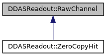

do not remove this div, it is closed by doxygen! 
|  |
| --- |
| NSCL DDAS12.1-001Support for XIA DDAS at FRIB |

 end header part 
 Generated by Doxygen 1.9.1 

 window showing the filter options 

 iframe showing the search results (closed by default) 

- [[DDASReadout|namespaceDDASReadout]]
- [[RawChannel|structDDASReadout_1_1RawChannel]]

 top 
[Public Member Functions](#pub-methods) |
[Static Public Member Functions](#pub-static-methods) |
[Public Attributes](#pub-attribs) |
[[List of all members|structDDASReadout_1_1RawChannel-members]]

DDASReadout::RawChannel Struct Reference

header
A struct containing a pointer to a hit and its properties.  
 [[More...|structDDASReadout_1_1RawChannel#details]]

`#include <RawChannel.h>`

Inheritance diagram for DDASReadout::RawChannel:

[[[legend|graph_legend]]]

|  |  |
| --- | --- |
| Public Member Functions |
|  | RawChannel() |
|  | Default constructor.More... |
|  |
|  | RawChannel(size_t nWords) |
|  | Construct a channel for copy-in data.More... |
|  |
|  | RawChannel(size_t nWords, void *pZcopyData) |
|  | Constructor initialized with zero-copy hit data.More... |
|  |
| virtual | ~RawChannel() |
|  | Destructor.More... |
|  |
| int | SetTime() |
|  | Set the 48-bit timestamp data from the hit infomration.More... |
|  |
| int | SetTime(double nsPerTick, bool useExt=false) |
|  | Set time time in ns.More... |
|  |
| int | SetLength() |
|  | Set the event length from the data.More... |
|  |
| int | SetChannel() |
|  | Set the channel value from the data.More... |
|  |
| int | Validate(int expecting) |
|  | Determine if a channel has the correct amount of data.More... |
|  |
| void | setData(size_t nWords, void *pZCopyData) |
|  | Set new data.More... |
|  |
| void | copyInData(size_t nWords, const void *pData) |
|  | Copy in data.More... |
|  |
|  | RawChannel(constRawChannel&rhs) |
|  | Copy constructor.More... |
|  |
| RawChannel& | operator=(constRawChannel&rhs) |
|  | Assignment operator.More... |
|  |

|  |  |
| --- | --- |
| Static Public Member Functions |
| static uint32_t | channelLength(void *pData) |
|  | Extract the number of words in a hit.More... |
|  |
| static double | moduleCalibration(uint32_t moduleType) |
|  | Returns the multiplier used to convert the module raw timestamp into nanoseconds.More... |
|  |

|  |  |
| --- | --- |
| Public Attributes |
| uint32_t | s_moduleType |
|  | Type of module this comes from.More... |
|  |
| double | s_time |
|  | Extracted time, possibly calibrated.More... |
|  |
| int | s_chanid |
|  | Channel within module.More... |
|  |
| bool | s_ownData |
|  | True if we own s_data.More... |
|  |
| int | s_ownDataSize |
|  | If we own data, how many uint32_t's.More... |
|  |
| int | s_channelLength |
|  | Number of uint32_t in s_data.More... |
|  |
| uint32_t * | s_data |
|  | Pointer to the hit data.More... |
|  |

## Detailed Description

A struct containing a pointer to a hit and its properties.

The struct can be used in either zero copy or copy mode. In zero-copy mode, a channel's data pointer points to some buffer that may have raw data from more than one hit. In copy mode, the data are dynamically allocated to hold the raw hit.

## Constructor & Destructor Documentation

## [◆](#ae02a90966bd1968a6c1046919c010445)RawChannel() [1/4]

|  |  |  |  |  |
| --- | --- | --- | --- | --- |
| DDASReadout::RawChannel::RawChannel | ( |  | ) |  |

Default constructor.

Constructs a new raw channel that could be used in either zerocopy or copy mode. The size and data are not yet set and the ownData flag is set false since we don't need to delete.

## [◆](#a741e7d89b955cb5d6396b7f439f1ec41)RawChannel() [2/4]

|  |  |  |  |  |  |
| --- | --- | --- | --- | --- | --- |
| DDASReadout::RawChannel::RawChannel | ( | size_t | nWords | ) |  |

Construct a channel for copy-in data.

Parameters
|  |  |
| --- | --- |
| nWords | Number of data words to pre-allocate. |

Exceptions
|  |  |
| --- | --- |
| std::bad_alloc | If malloc of pre-allocated storage fails. |

Construts a channel for copy in data. Data are pre-allocated as demanded but not initialized. We use malloc rather than new because new will construct (initialize) ints to zero and we don't want to take that time.

Data must eventually be provided by calling copyInData.

Noteafter this call, m_ownData is true and m_ownDataSize is set to nWords.

## [◆](#a160e32d0293f8f4fe2f12c988d78fa5c)RawChannel() [3/4]

|  |  |  |  |
| --- | --- | --- | --- |
| DDASReadout::RawChannel::RawChannel | ( | size_t | nWords, |
|  |  | void * | pZCopyData |
|  | ) |  |  |

Constructor initialized with zero-copy hit data.

Parameters
|  |  |
| --- | --- |
| nWords | Number of data words to pre-allocate. |
| pZCopyData | Pointer to the data of the hit. |

NoteThe data pointed to by pZCopyData must be in scope for the duration of this object's lifetime else probably segfaults or bus errors will happen in the best case.

## [◆](#ac615b7ee7644eb3591b0001bf3ef6dc4)~RawChannel()

|  |  |  |  |  |  |  |
| --- | --- | --- | --- | --- | --- | --- |
| DDASReadout::RawChannel::~RawChannel() | DDASReadout::RawChannel::~RawChannel | ( |  | ) |  | virtual |
| DDASReadout::RawChannel::~RawChannel | ( |  | ) |  |

Destructor.

If we own the data, this will free it.

## [◆](#ac9ce4ff674d12974ab08e17b605a12e3)RawChannel() [4/4]

|  |  |  |  |  |  |
| --- | --- | --- | --- | --- | --- |
| DDASReadout::RawChannel::RawChannel | ( | constRawChannel& | rhs | ) |  |

Copy constructor.

Parameters
|  |  |
| --- | --- |
| rhs | The object we're copying into this. |

This is just assignment to *this once we're appropriately initialized.

## Member Function Documentation

## [◆](#acf06d3419b501848eccb2bee986bafe9)channelLength()

|  |  |  |  |  |  |  |  |
| --- | --- | --- | --- | --- | --- | --- | --- |
| uint32_t DDASReadout::RawChannel::channelLength(void *pData) | uint32_t DDASReadout::RawChannel::channelLength | ( | void * | pData | ) |  | static |
| uint32_t DDASReadout::RawChannel::channelLength | ( | void * | pData | ) |  |

Extract the number of words in a hit.

Parameters
|  |  |
| --- | --- |
| pData | Pointer to the hit data. |

ReturnsThe length of the hit.

## [◆](#a1cdbebc5dd8aa1f35d572079cff69c0c)copyInData()

|  |  |  |  |
| --- | --- | --- | --- |
| void DDASReadout::RawChannel::copyInData | ( | size_t | nWords, |
|  |  | const void * | pData |
|  | ) |  |  |

Copy in data.

Parameters
|  |  |
| --- | --- |
| nWords | The new channel length (32-bit words). |
| pData | Pointer to the data to copy in. |

- If s_ownData is false, then allocate sufficient storage for the hit.
- If s_ownData is true, and the amount of data we have is too small, allocate new data to hold it.
- Copy the hit into our owned data.

## [◆](#af2be5fd58d780069deb9fe27b3cb9edf)moduleCalibration()

|  |  |  |  |  |  |  |  |
| --- | --- | --- | --- | --- | --- | --- | --- |
| double DDASReadout::RawChannel::moduleCalibration(uint32_tmoduleType) | double DDASReadout::RawChannel::moduleCalibration | ( | uint32_t | moduleType | ) |  | static |
| double DDASReadout::RawChannel::moduleCalibration | ( | uint32_t | moduleType | ) |  |

Returns the multiplier used to convert the module raw timestamp into nanoseconds.

Parameters
|  |  |
| --- | --- |
| moduleType | The module type/speed etc. word that's normally prepended to hit data. |

ReturnsThe timestamp multiplier.

## [◆](#abf5e54d19345538acd16a563afb80eca)operator=()

|  |  |  |  |  |  |
| --- | --- | --- | --- | --- | --- |
| RawChannel& DDASReadout::RawChannel::operator= | ( | constRawChannel& | rhs | ) |  |

Assignment operator.

Parameters
|  |  |
| --- | --- |
| rhs | The object we'er assigning to this. |

ReturnsPointer to lhs (*this).
Only works if this != &rhs. There are piles of cases to consider:

- rhs is zero copy: we'll zero copy.
- rhs is dynamic: we'll be a dynamic deep copy.

These two cases and their subcases are handled by setData and copyInData respectively.

## [◆](#a1143576edf8acc08fcf55ca351e6e3de)SetChannel()

|  |  |  |  |  |
| --- | --- | --- | --- | --- |
| int DDASReadout::RawChannel::SetChannel | ( |  | ) |  |

Set the channel value from the data.

Returnsint 
Return values
|  |  |
| --- | --- |
| 0 | Success. |
| 1 | Insufficent data in the hit or the hit has not been set. |

## [◆](#aadfa560d832709ff5f65b94d578fb309)setData()

|  |  |  |  |
| --- | --- | --- | --- |
| void DDASReadout::RawChannel::setData | ( | size_t | nWords, |
|  |  | void * | pZCopyData |
|  | ) |  |  |

Set new data.

Parameters
|  |  |
| --- | --- |
| nWords | The new channel length (32-bit words). |
| pZCopyData | Pointer to the data to set. |

Perform at most two tasks:

- If we own data already, it's freed and the channel length is reset to zero (0).
- The data and channel length of the data are set from the parameters.

## [◆](#afb067fdd1cf2842d8f38aeaa2e129c85)SetLength()

|  |  |  |  |  |
| --- | --- | --- | --- | --- |
| int DDASReadout::RawChannel::SetLength | ( |  | ) |  |

Set the event length from the data.

Returns0 Always.

## [◆](#a1025dc1b3de71acff62887e169de761d)SetTime() [1/2]

|  |  |  |  |  |
| --- | --- | --- | --- | --- |
| int DDASReadout::RawChannel::SetTime | ( |  | ) |  |

Set the 48-bit timestamp data from the hit infomration.

Returnsint 
Return values
|  |  |
| --- | --- |
| 0 | Success. |
| 1 | If the number of data words is insufficient (< 4). |

Assumes that the data are set using the `setData()` or `copyInData()` methods of this class. Determine the raw timestamp from the 48-bit timestamp data in the hit and set it in s_time. The timestamp is extracted from data words 1 and 2 of the Pixie-16 list mode event header structure in the hit.

NoteIf the data have not yet been set, number of words is 0 so this is well behaved.

## [◆](#ab1225e5f57236f342ebac2699057c189)SetTime() [2/2]

|  |  |  |  |
| --- | --- | --- | --- |
| int DDASReadout::RawChannel::SetTime | ( | double | nsPerTick, |
|  |  | bool | useExt=false |
|  | ) |  |  |

Set time time in ns.

Parameters
|  |  |
| --- | --- |
| nsPerTick | Clock calibration in nanoseconds per clock tick. |
| useExt | True if using an external timestamp (default=false). |

Returnsint 
Return values
|  |  |
| --- | --- |
| 0 | Success. |
| 1 | Failure, which can happen in the following ways:If attempting to use the external timestamp but none is present in the data (header has insufficient words).If not using an external timestamp, but the number of data words are insufficient (< 4). |

This function assumes that the data are set using either the `setData()` or `copyInData()` methods of this class. Note that `setData()` is used for zero-copy. Determine the calibrated timestamp from the 48-bit timestamp data in the hit and set it in s_time. The timestamp is extracted from data words 1 and 2 of the Pixie-16 list mode event header structure in the hit. The clock calibration passed to this function is used to convert the time to nanoseconds from clock ticks.

NoteIn Pixie systems, the value of nsPerTick is module-dependent. 

If the data have not yet been set, number of words is 0 so this is well behaved.

## [◆](#a4f954ae86246843a4ebbd2ef113ebbdf)Validate()

|  |  |  |  |  |  |
| --- | --- | --- | --- | --- | --- |
| int DDASReadout::RawChannel::Validate | ( | int | expecting | ) |  |

Determine if a channel has the correct amount of data.

Parameters
|  |  |
| --- | --- |
| expecting | The expected channel length in 32-bit words. |

Returnsint 
Return values
|  |  |
| --- | --- |
| 0 | Correct length. |
| 1 | Incorrect channel length. A message is output to std::cerr. |

Retains rough compatibility with the old channel class.

**[[Todo:|todo#_todo000023]]**(ASC 1/23/24): An old and somewhat cryptic comment about "hating 
the output" but maintaining it for compatibility. Perhaps because we write to stderr and return 1 instead of raising an exception?

## Member Data Documentation

## [◆](#a501cd8167cec55226136d15f95f16e20)s_chanid

|  |
| --- |
| int DDASReadout::RawChannel::s_chanid |

Channel within module.

## [◆](#a743cf78929046df7979c98c2ce54d246)s_channelLength

|  |
| --- |
| int DDASReadout::RawChannel::s_channelLength |

Number of uint32_t in s_data.

## [◆](#afd457d4da3c346e4477362f63b1c332d)s_data

|  |
| --- |
| uint32_t* DDASReadout::RawChannel::s_data |

Pointer to the hit data.

## [◆](#af937289721f5495c31218fafbba551fe)s_moduleType

|  |
| --- |
| uint32_t DDASReadout::RawChannel::s_moduleType |

Type of module this comes from.

## [◆](#a14ce9fb1311750d3fbac1615f85af16e)s_ownData

|  |
| --- |
| bool DDASReadout::RawChannel::s_ownData |

True if we own s_data.

## [◆](#acc8e94d864512ee4a620494967758f6c)s_ownDataSize

|  |
| --- |
| int DDASReadout::RawChannel::s_ownDataSize |

If we own data, how many uint32_t's.

## [◆](#a99390756b2ad85cd0533216f5d818ee0)s_time

|  |
| --- |
| double DDASReadout::RawChannel::s_time |

Extracted time, possibly calibrated.

---

The documentation for this struct was generated from the following files:- [[RawChannel.h|RawChannel_8h_source]]
- [[RawChannel.cpp|RawChannel_8cpp]]

 contents 
 start footer part 

---

Generated by  1.9.1
