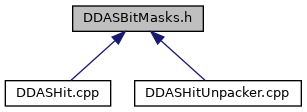

do not remove this div, it is closed by doxygen! 
|  |
| --- |
| DDAS Format1.1.1A self-contained, lightweight format library and unpacker for DDAS data |

 end header part 
 Generated by Doxygen 1.9.1 

 window showing the filter options 

 iframe showing the search results (closed by default)

 top 
DDASBitMasks.h File Reference

header
Define bit masks to extract data from specific locations of Pixie data. Bit masks are inclusive: Bits [3:0] means mask bits 3, 2, 1, 0. Shift offsets are provided for masks where the offset is not obvious from the mask name.  
[More...](#details)

This graph shows which files directly or indirectly include this file:

[[DDASBitMasks_8h_source]]

## Detailed Description

Define bit masks to extract data from specific locations of Pixie data. Bit masks are inclusive: Bits [3:0] means mask bits 3, 2, 1, 0. Shift offsets are provided for masks where the offset is not obvious from the mask name.

 contents 
 start footer part 

---

Generated by  1.9.1
