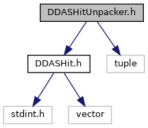
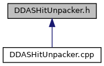

do not remove this div, it is closed by doxygen! 
|  |
| --- |
| DDAS Format1.1.1A self-contained, lightweight format library and unpacker for DDAS data |

 end header part 
 Generated by Doxygen 1.9.1 

 window showing the filter options 

 iframe showing the search results (closed by default)

 top 
[Classes](#nested-classes)

DDASHitUnpacker.h File Reference

header
Define an unpacker for DDAS data recorded by NSCLDAQ/FRIBDAQ.  
[More...](#details)

`#include "DDASHit.h"`  

`#include <tuple>`

Include dependency graph for DDASHitUnpacker.h:

This graph shows which files directly or indirectly include this file:

[[Go to the source code of this file.|https://github.com/FRIBDAQ/docs/tree/main/ddasformat-1.1-001/DDASHitUnpacker_8h_source.md]]

|  |  |
| --- | --- |
| Classes |
| class | ddasfmt::DDASHitUnpacker |
|  | Unpacker for DDAS data recorded by NSCLDAQ.More... |
|  |

## Detailed Description

Define an unpacker for DDAS data recorded by NSCLDAQ/FRIBDAQ.

 contents 
 start footer part 

---

Generated by  1.9.1
