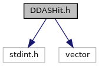
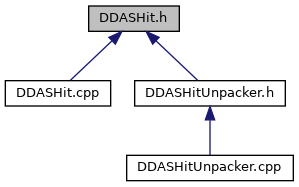

do not remove this div, it is closed by doxygen! 
|  |
| --- |
| DDAS Format1.1.1A self-contained, lightweight format library and unpacker for DDAS data |

 end header part 
 Generated by Doxygen 1.9.1 

 window showing the filter options 

 iframe showing the search results (closed by default)

 top 
[Classes](#nested-classes)

DDASHit.h File Reference

header
DDASHit class definition.  
[More...](#details)

`#include <stdint.h>`  

`#include <vector>`

Include dependency graph for DDASHit.h:

This graph shows which files directly or indirectly include this file:

[[DDASHit_8h_source]]

|  |  |
| --- | --- |
| Classes |
| class | ddasfmt::DDASHit |
|  | Encapsulation of a generic DDAS event.More... |
|  |

## Detailed Description

DDASHit class definition.

 contents 
 start footer part 

---

Generated by  1.9.1
