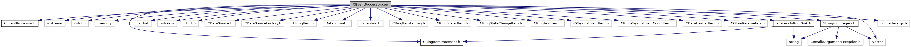

do not remove this div, it is closed by doxygen! 
|  |
| --- |
| DDASToys for NSCLDAQ6.2-000 |

 end header part 
 Generated by Doxygen 1.9.1 

 window showing the filter options 

 iframe showing the search results (closed by default) 

- [[dir_04a3fafa7c4b2a9dfdb897dd54125b19]]

 top 
CEventProcessor.cpp File Reference

header
Implement class for processing events. Create and call a ring item processor and let it decide what to do with the data.  
[More...](#details)

`#include "CEventProcessor.h"`  

`#include <iostream>`  

`#include <cstdlib>`  

`#include <memory>`  

`#include <vector>`  

`#include <cstdint>`  

`#include <sstream>`  

`#include <URL.h>`  

`#include <CDataSource.h>`  

`#include <CDataSourceFactory.h>`  

`#include <CRingItem.h>`  

`#include <DataFormat.h>`  

`#include <Exception.h>`  

`#include <CRingItemFactory.h>`  

`#include <CRingScalerItem.h>`  

`#include <CRingStateChangeItem.h>`  

`#include <CRingTextItem.h>`  

`#include <CPhysicsEventItem.h>`  

`#include <CRingPhysicsEventCountItem.h>`  

`#include <CDataFormatItem.h>`  

`#include <CGlomParameters.h>`  

`#include "CRingItemProcessor.h"`  

`#include "ProcessToRootSink.h"`  

`#include "StringsToIntegers.h"`  

`#include "converterargs.h"`

Include dependency graph for CEventProcessor.cpp:

## Detailed Description

Implement class for processing events. Create and call a ring item processor and let it decide what to do with the data.

 contents 
 start footer part 

---

Generated by  1.9.1
