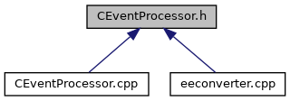

do not remove this div, it is closed by doxygen! 
|  |
| --- |
| DDASToys for NSCLDAQ6.2-000 |

 end header part 
 Generated by Doxygen 1.9.1 

 window showing the filter options 

 iframe showing the search results (closed by default) 

- [[EEConverter|https://github.com/FRIBDAQ/docs/tree/main/ddastoys-6.2-000/dir_04a3fafa7c4b2a9dfdb897dd54125b19.md]]

 top 
[Classes](#nested-classes)

CEventProcessor.h File Reference

header
Define an event proessor for reading ring items from a source. Generally a file for this application, creating an analysis pipleline to consume ring items from a ringbuffer is untested.  
[More...](#details)

This graph shows which files directly or indirectly include this file:

[[Go to the source code of this file.|https://github.com/FRIBDAQ/docs/tree/main/ddastoys-6.2-000/CEventProcessor_8h_source.md]]

|  |  |
| --- | --- |
| Classes |
| class | CEventProcessor |
|  | Define an event processor for DDAS data.More... |
|  |

## Detailed Description

Define an event proessor for reading ring items from a source. Generally a file for this application, creating an analysis pipleline to consume ring items from a ringbuffer is untested.

 contents 
 start footer part 

---

Generated by  1.9.1
