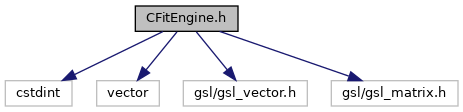
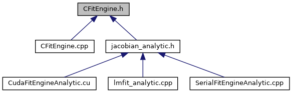

do not remove this div, it is closed by doxygen! 
|  |
| --- |
| DDASToys for NSCLDAQ6.2-000 |

 end header part 
 Generated by Doxygen 1.9.1 

 window showing the filter options 

 iframe showing the search results (closed by default)

 top 
[Classes](#nested-classes)

CFitEngine.h File Reference

header
Define the CFitEngine abstract base class.  
[More...](#details)

`#include <cstdint>`  

`#include <vector>`  

`#include <gsl/gsl_vector.h>`  

`#include <gsl/gsl_matrix.h>`

Include dependency graph for CFitEngine.h:

This graph shows which files directly or indirectly include this file:

[[Go to the source code of this file.|CFitEngine_8h_source]]

|  |  |
| --- | --- |
| Classes |
| class | ddastoys::CFitEngine |
|  | Abstract base class for marshalling data to the fitting subsystems to calculate Jacobian elements and residuals.More... |
|  |

## Detailed Description

Define the CFitEngine abstract base class.

 contents 
 start footer part 

---

Generated by  1.9.1
