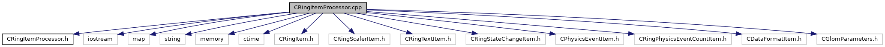

do not remove this div, it is closed by doxygen! 
|  |
| --- |
| DDASToys for NSCLDAQ6.2-000 |

 end header part 
 Generated by Doxygen 1.9.1 

 window showing the filter options 

 iframe showing the search results (closed by default)

 top 
CRingItemProcessor.cpp File Reference

header
Default implementation of the the [[classCRingItemProcessor]] class methods.  
[More...](#details)

`#include "CRingItemProcessor.h"`  

`#include <iostream>`  

`#include <map>`  

`#include <string>`  

`#include <memory>`  

`#include <ctime>`  

`#include <CRingItem.h>`  

`#include <CRingScalerItem.h>`  

`#include <CRingTextItem.h>`  

`#include <CRingStateChangeItem.h>`  

`#include <CPhysicsEventItem.h>`  

`#include <CRingPhysicsEventCountItem.h>`  

`#include <CDataFormatItem.h>`  

`#include <CGlomParameters.h>`

Include dependency graph for CRingItemProcessor.cpp:

## Detailed Description

Default implementation of the the [[classCRingItemProcessor]] class methods.

 contents 
 start footer part 

---

Generated by  1.9.1
