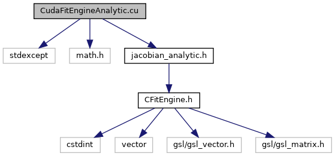

do not remove this div, it is closed by doxygen! 
|  |
| --- |
| DDASToys for NSCLDAQ6.2-000 |

 end header part 
 Generated by Doxygen 1.9.1 

 window showing the filter options 

 iframe showing the search results (closed by default)

 top 
[Functions](#func-members)

CudaFitEngineAnalytic.cu File Reference

header
Provide CUDA fit engines for single- and double-pulse fits.  
[More...](#details)

`#include <stdexcept>`  

`#include <math.h>`  

`#include "jacobian_analytic.h"`

Include dependency graph for CudaFitEngineAnalytic.cu:

|  |  |
| --- | --- |
| Functions |
| __global__ void | residual1(void *tx, void *ty, void *res, unsigned len, float C, float A, float k1, float k2, float x1) |
|  | Compute the residual for a point in the trace with a single pulse fit.More... |
|  |
| __global__ void | jacobian1(void *tx, void *ty, void *jac, unsigned len, float A, float k1, float k2, float x1) |
|  | Compute the Jacobian at a single point of the trace for a single pulse fit.More... |
|  |
| __global__ void | residual2(void *xtc, void *ytc, void *res, unsigned npts, float C, float A1, float k11, float k12, float x1, float A2, float k21, float k22, float x2) |
|  | Computes the double-pulse residual pointwise parallel.More... |
|  |
| __global__ void | jacobian2(void *xtc, void *jac, unsigned npts, double A1, double k1, double k2, double x1, double A2, double k3, double k4, double x2, double C) |
|  | Compute the double-pulse Jacobian on a point of the pulse. The Jacobian matrix is an npts x 9 matrix.More... |
|  |

## Detailed Description

Provide CUDA fit engines for single- and double-pulse fits.

NoteThis requires that the CUDA compiler be used. 

Experimentally the Jacobian for double pulses needs to be double precision so we've got functions named XXXX which are float and identical functions named XXXXd which are double.

## Function Documentation

## [◆](#a74c7f8f4f9fbbf729c86b69bddf1f022)jacobian1()

|  |  |  |  |
| --- | --- | --- | --- |
| __global__ void jacobian1 | ( | void * | tx, |
|  |  | void * | ty, |
|  |  | void * | jac, |
|  |  | unsigned | len, |
|  |  | float | A, |
|  |  | float | k1, |
|  |  | float | k2, |
|  |  | float | x1 |
|  | ) |  |  |

Compute the Jacobian at a single point of the trace for a single pulse fit.

Parameters
|  |  |
| --- | --- |
| tx | Pointer to the trace x coords. |
| ty | Pointer to the trace y coords. |
| jac | Pointer to the Jacobian matrix (len*5 elements) |
| len | Trace length. |
| A | Scale factor. |
| k1 | Risetime steepeness. |
| k2 | Decay time. |
| x1 | Position. |

## [◆](#ad40fd9b253a8e43081efdb7256683bf3)jacobian2()

|  |  |  |  |
| --- | --- | --- | --- |
| __global__ void jacobian2 | ( | void * | xtc, |
|  |  | void * | jac, |
|  |  | unsigned | npts, |
|  |  | double | A1, |
|  |  | double | k1, |
|  |  | double | k2, |
|  |  | double | x1, |
|  |  | double | A2, |
|  |  | double | k3, |
|  |  | double | k4, |
|  |  | double | x2, |
|  |  | double | C |
|  | ) |  |  |

Compute the double-pulse Jacobian on a point of the pulse. The Jacobian matrix is an npts x 9 matrix.

Parameters
|  |  |
| --- | --- |
| xtc | x-coordinates of the trace. |
| jac | Jacobian matrix. |
| npts | Number of points in the fit. |
| A1,k1,k2,x1 | Fit parameters for first pulse. |
| A2,k3,k4,x2 | Fit parameters for the second pulse. |
| C | Constant term of the fit. |

## [◆](#af24b5634521d89be6f24b952b158ba4d)residual1()

|  |  |  |  |
| --- | --- | --- | --- |
| __global__ void residual1 | ( | void * | tx, |
|  |  | void * | ty, |
|  |  | void * | res, |
|  |  | unsigned | len, |
|  |  | float | C, |
|  |  | float | A, |
|  |  | float | k1, |
|  |  | float | k2, |
|  |  | float | x1 |
|  | ) |  |  |

Compute the residual for a point in the trace with a single pulse fit.

Parameters
|  |  |
| --- | --- |
| tx | Pointer to trace x values. |
| ty | Pointer to trace y values. |
| res | Pointer to residual values. |
| len | Number of trace elements. |
| C | Constant baseline. |
| A | Scale factor. |
| k1 | Rise steepeness. |
| k2 | Decay time. |
| x1 | Position. |

## [◆](#a8cb9184ed50b3cfc0b8dea0150e6d34e)residual2()

|  |  |  |  |
| --- | --- | --- | --- |
| __global__ void residual2 | ( | void * | xtc, |
|  |  | void * | ytc, |
|  |  | void * | res, |
|  |  | unsigned | npts, |
|  |  | float | C, |
|  |  | float | A1, |
|  |  | float | k11, |
|  |  | float | k12, |
|  |  | float | x1, |
|  |  | float | A2, |
|  |  | float | k21, |
|  |  | float | k22, |
|  |  | float | x2 |
|  | ) |  |  |

Computes the double-pulse residual pointwise parallel.

Parameters
|  |  |
| --- | --- |
| xtc | x-coordinates of trace. |
| ytc | y-coordinates of trace. |
| res | Residuals to compute. |
| npts | Number of trace points. |
| C | Constant offset fit parameter. |
| A1 | Scale factor for pulse1. |
| k11 | k1 for pulse 1. |
| k12 | k2 for pulse 1. |
| x1 | Position of pulse 1 |
| A2 | Scale factof for pulse 2. |
| k21 | k1 for pulse 2. |
| k22 | k2 for pulse 2. |
| x2 | Position of pulse 2. |

 contents 
 start footer part 

---

Generated by  1.9.1
