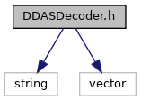
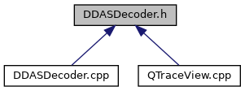

do not remove this div, it is closed by doxygen! 
|  |
| --- |
| DDASToys for NSCLDAQ6.2-000 |

 end header part 
 Generated by Doxygen 1.9.1 

 window showing the filter options 

 iframe showing the search results (closed by default) 

- [[dir_618b423c2be057087b8e9298ecdc31ba]]

 top 
[Classes](#nested-classes)

DDASDecoder.h File Reference

header
Define an event proessor for reading ring items from a source, in this case a file. Very similar to the [[classCEventProcessor]] class but really designed to work interactively with the GUI.  
[More...](#details)

`#include <string>`  

`#include <vector>`

Include dependency graph for DDASDecoder.h:

This graph shows which files directly or indirectly include this file:

[[DDASDecoder_8h_source]]

|  |  |
| --- | --- |
| Classes |
| class | DDASDecoder |
|  | An interactive event processor integrated in the traceview GUI.More... |
|  |

## Detailed Description

Define an event proessor for reading ring items from a source, in this case a file. Very similar to the [[classCEventProcessor]] class but really designed to work interactively with the GUI.

 contents 
 start footer part 

---

Generated by  1.9.1
