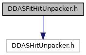
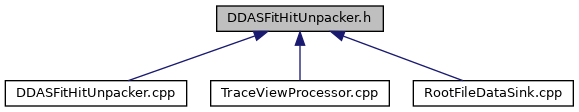

do not remove this div, it is closed by doxygen! 
|  |
| --- |
| DDASToys for NSCLDAQ6.2-000 |

 end header part 
 Generated by Doxygen 1.9.1 

 window showing the filter options 

 iframe showing the search results (closed by default)

 top 
[Classes](#nested-classes)

DDASFitHitUnpacker.h File Reference

header
Defines a class to unpack DDAS data with fit extensions.  
[More...](#details)

`#include <DDASHitUnpacker.h>`

Include dependency graph for DDASFitHitUnpacker.h:

This graph shows which files directly or indirectly include this file:

[[DDASFitHitUnpacker_8h_source]]

|  |  |
| --- | --- |
| Classes |
| class | ddastoys::DDASFitHitUnpacker |
|  | Unpack raw hit data from DDAS event files.More... |
|  |

## Detailed Description

Defines a class to unpack DDAS data with fit extensions.

NoteDDASFitHitUnpacker is in the ddastoys namespace.

 contents 
 start footer part 

---

Generated by  1.9.1
