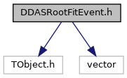
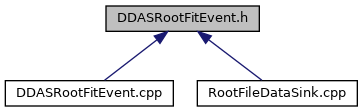

do not remove this div, it is closed by doxygen! 
|  |
| --- |
| DDASToys for NSCLDAQ6.2-000 |

 end header part 
 Generated by Doxygen 1.9.1 

 window showing the filter options 

 iframe showing the search results (closed by default) 

- [[dir_04a3fafa7c4b2a9dfdb897dd54125b19]]

 top 
[Classes](#nested-classes)

DDASRootFitEvent.h File Reference

header
Header for events that are writable to ROOT trees.  
[More...](#details)

`#include <TObject.h>`  

`#include <vector>`

Include dependency graph for DDASRootFitEvent.h:

This graph shows which files directly or indirectly include this file:

[[DDASRootFitEvent_8h_source]]

|  |  |
| --- | --- |
| Classes |
| class | ddastoys::DDASRootFitEvent |
|  | Defines the object that's put in a ROOT TTree for each event.More... |
|  |

## Detailed Description

Header for events that are writable to ROOT trees.

 contents 
 start footer part 

---

Generated by  1.9.1
