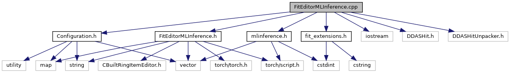

do not remove this div, it is closed by doxygen! 
|  |
| --- |
| DDASToys for NSCLDAQ6.2-000 |

 end header part 
 Generated by Doxygen 1.9.1 

 window showing the filter options 

 iframe showing the search results (closed by default)

 top 
[Functions](#func-members)

FitEditorMLInference.cpp File Reference

header
Implementation of the FitEditor class for machine-learning inference.  
[More...](#details)

`#include "FitEditorMLInference.h"`  

`#include <iostream>`  

`#include <DDASHit.h>`  

`#include <DDASHitUnpacker.h>`  

`#include "Configuration.h"`  

`#include "fit_extensions.h"`  

`#include "mlinference.h"`

Include dependency graph for FitEditorMLInference.cpp:

|  |  |
| --- | --- |
| Functions |
| ddastoys::FitEditorMLInference* | createEditor() |
|  | Factory method to create this FitEditor.More... |
|  |

## Detailed Description

Implementation of the FitEditor class for machine-learning inference.

## Function Documentation

## [◆](#aaa4a73397d9bfa97acdbbd5d60b2cdd7)createEditor()

|  |  |  |  |  |
| --- | --- | --- | --- | --- |
| ddastoys::FitEditorMLInference* createEditor | ( |  | ) |  |

Factory method to create this FitEditor.

$DAQBIN/EventEditor expects a symbol called createEditor to exist in the plugin library it loads at runtime. Wrapping the factory method in extern "C" prevents namespace mangling by the C++ compiler.

 contents 
 start footer part 

---

Generated by  1.9.1
