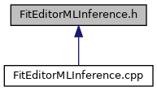

do not remove this div, it is closed by doxygen! 
|  |
| --- |
| DDASToys for NSCLDAQ6.2-000 |

 end header part 
 Generated by Doxygen 1.9.1 

 window showing the filter options 

 iframe showing the search results (closed by default)

 top 
[Classes](#nested-classes)

FitEditorMLInference.h File Reference

header
Definition of the FitEditor class for machine-learning inference.  
[More...](#details)

`#include <CBuiltRingItemEditor.h>`  

`#include <vector>`  

`#include <string>`  

`#include <map>`  

`#include <torch/script.h>`  

`#include <torch/torch.h>`

Include dependency graph for FitEditorMLInference.h:

This graph shows which files directly or indirectly include this file:

[[FitEditorMLInference_8h_source]]

|  |  |
| --- | --- |
| Classes |
| class | ddastoys::FitEditorMLInference |
|  | Fit trace data using machine-learning inference with a detector response model defined by the analytic fit functions.More... |
|  |

## Detailed Description

Definition of the FitEditor class for machine-learning inference.

 contents 
 start footer part 

---

Generated by  1.9.1
