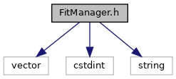
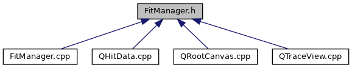

do not remove this div, it is closed by doxygen! 
|  |
| --- |
| DDASToys for NSCLDAQ6.2-000 |

 end header part 
 Generated by Doxygen 1.9.1 

 window showing the filter options 

 iframe showing the search results (closed by default) 

- [[dir_618b423c2be057087b8e9298ecdc31ba]]

 top 
[Classes](#nested-classes) |
[Enumerations](#enum-members)

FitManager.h File Reference

header
Defines a class for managing fits including calulating fit function values from fit parameters and fit configuration settings using the Configuraton class.  
[More...](#details)

`#include <vector>`  

`#include <cstdint>`  

`#include <string>`

Include dependency graph for FitManager.h:

This graph shows which files directly or indirectly include this file:

[[FitManager_8h_source]]

|  |  |
| --- | --- |
| Classes |
| class | FitManager |
|  | Provides an interface for calculating trace fits using HitExtension fit parameters.More... |
|  |

|  |  |
| --- | --- |
| Enumerations |
| enum | fitMethod{ANALYTIC,TEMPLATE,ML_INFERENCE} |
|  | Fit method enum class.More... |
|  |

## Detailed Description

Defines a class for managing fits including calulating fit function values from fit parameters and fit configuration settings using the Configuraton class.

## Enumeration Type Documentation

## [◆](#aaa6963c10d1ae605801287375f0b2599)fitMethod

|  |
| --- |
| enumfitMethod |

Fit method enum class.

|  |  |
| --- | --- |
| Enumerator |
| ANALYTIC | Analytic fit. |
| TEMPLATE | Template fit. |
| ML_INFERENCE | Machine learning inference fit. |

 contents 
 start footer part 

---

Generated by  1.9.1
