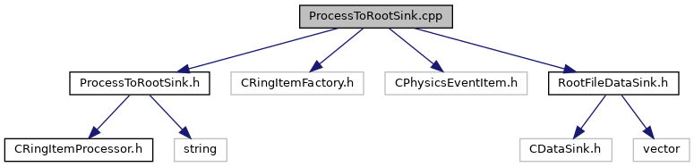

do not remove this div, it is closed by doxygen! 
|  |
| --- |
| DDASToys for NSCLDAQ6.2-000 |

 end header part 
 Generated by Doxygen 1.9.1 

 window showing the filter options 

 iframe showing the search results (closed by default) 

- [[EEConverter|dir_04a3fafa7c4b2a9dfdb897dd54125b19]]

 top 
ProcessToRootSink.cpp File Reference

header
Implement mandatory interface from [[CRingItemProcessor|classCRingItemProcessor]] to process data to a ROOT file sink.  
[More...](#details)

`#include "ProcessToRootSink.h"`  

`#include <CRingItemFactory.h>`  

`#include <CPhysicsEventItem.h>`  

`#include "RootFileDataSink.h"`

Include dependency graph for ProcessToRootSink.cpp:

## Detailed Description

Implement mandatory interface from [[CRingItemProcessor|classCRingItemProcessor]] to process data to a ROOT file sink.

 contents 
 start footer part 

---

Generated by  1.9.1
