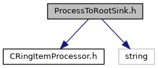
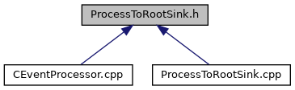

do not remove this div, it is closed by doxygen! 
|  |
| --- |
| DDASToys for NSCLDAQ6.2-000 |

 end header part 
 Generated by Doxygen 1.9.1 

 window showing the filter options 

 iframe showing the search results (closed by default) 

- [[dir_04a3fafa7c4b2a9dfdb897dd54125b19]]

 top 
[Classes](#nested-classes)

ProcessToRootSink.h File Reference

header
Define a ring item processes which processes data into a ROOT data file sink.  
[More...](#details)

`#include <CRingItemProcessor.h>`  

`#include <string>`

Include dependency graph for ProcessToRootSink.h:

This graph shows which files directly or indirectly include this file:

[[ProcessToRootSink_8h_source]]

|  |  |
| --- | --- |
| Classes |
| class | ProcessToRootSink |
|  | A ring item processeor concrete class that overrides theCRingItemProcessorbase class method to put PHYSICS_EVENTs into a ROOT file data sink.More... |
|  |

## Detailed Description

Define a ring item processes which processes data into a ROOT data file sink.

 contents 
 start footer part 

---

Generated by  1.9.1
