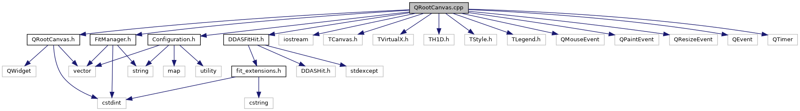

do not remove this div, it is closed by doxygen! 
|  |
| --- |
| DDASToys for NSCLDAQ6.2-000 |

 end header part 
 Generated by Doxygen 1.9.1 

 window showing the filter options 

 iframe showing the search results (closed by default) 

- [[dir_618b423c2be057087b8e9298ecdc31ba]]

 top 
QRootCanvas.cpp File Reference

header
Implementation of Qt-embedded ROOT canvas class.  
[More...](#details)

`#include "QRootCanvas.h"`  

`#include <iostream>`  

`#include <TCanvas.h>`  

`#include <TVirtualX.h>`  

`#include <TH1D.h>`  

`#include <TStyle.h>`  

`#include <TLegend.h>`  

`#include <QMouseEvent>`  

`#include <QPaintEvent>`  

`#include <QResizeEvent>`  

`#include <QEvent>`  

`#include <QTimer>`  

`#include <Configuration.h>`  

`#include <DDASFitHit.h>`  

`#include "FitManager.h"`

Include dependency graph for QRootCanvas.cpp:

## Detailed Description

Implementation of Qt-embedded ROOT canvas class.

 contents 
 start footer part 

---

Generated by  1.9.1
