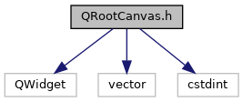
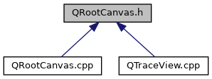

do not remove this div, it is closed by doxygen! 
|  |
| --- |
| DDASToys for NSCLDAQ6.2-000 |

 end header part 
 Generated by Doxygen 1.9.1 

 window showing the filter options 

 iframe showing the search results (closed by default) 

- [TraceView](https://github.com/FRIBDAQ/docs/tree/main/ddastoys-6.2-000/dir_618b423c2be057087b8e9298ecdc31ba.md)

 top 
[Classes](#nested-classes)

QRootCanvas.h File Reference

header
Defines a class for embedding a ROOT canvas in a Qt application.  
[More...](#details)

`#include <QWidget>`  

`#include <vector>`  

`#include <cstdint>`

Include dependency graph for QRootCanvas.h:

This graph shows which files directly or indirectly include this file:

[Go to the source code of this file.](https://github.com/FRIBDAQ/docs/tree/main/ddastoys-6.2-000/QRootCanvas_8h_source.md)

|  |  |
| --- | --- |
| Classes |
| class | QRootCanvas |
|  | A ROOT canvas embedded in a Qt application.More... |
|  |

## Detailed Description

Defines a class for embedding a ROOT canvas in a Qt application.

 contents 
 start footer part 

---

Generated by  1.9.1
