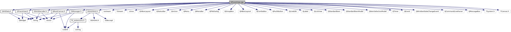

do not remove this div, it is closed by doxygen! 
|  |
| --- |
| DDASToys for NSCLDAQ6.2-000 |

 end header part 
 Generated by Doxygen 1.9.1 

 window showing the filter options 

 iframe showing the search results (closed by default) 

- [[TraceView|https://github.com/FRIBDAQ/docs/tree/main/ddastoys-6.2-000/dir_618b423c2be057087b8e9298ecdc31ba.md]]

 top 
QTraceView.cpp File Reference

header
Implement Qt main application window class.  
[More...](#details)

`#include "QTraceView.h"`  

`#include <iostream>`  

`#include <fstream>`  

`#include <ctime>`  

`#include <QVBoxLayout>`  

`#include <QStatusBar>`  

`#include <QAction>`  

`#include <QMenu>`  

`#include <QMenuBar>`  

`#include <QFileDialog>`  

`#include <QGroupBox>`  

`#include <QHBoxLayout>`  

`#include <QComboBox>`  

`#include <QPushButton>`  

`#include <QLineEdit>`  

`#include <QLabel>`  

`#include <QListView>`  

`#include <QStandardItem>`  

`#include <QStandardItemModel>`  

`#include <QItemSelectionModel>`  

`#include <QTimer>`  

`#include <QEvent>`  

`#include <QWindowStateChangeEvent>`  

`#include <QCommandLineParser>`  

`#include <QMessageBox>`  

`#include <TSystem.h>`  

`#include <TCanvas.h>`  

`#include <DDASFitHit.h>`  

`#include "FitManager.h"`  

`#include "DDASDecoder.h"`  

`#include "QHitData.h"`  

`#include "QRootCanvas.h"`

Include dependency graph for QTraceView.cpp:

## Detailed Description

Implement Qt main application window class.

 contents 
 start footer part 

---

Generated by  1.9.1
