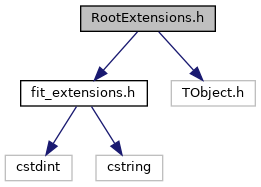
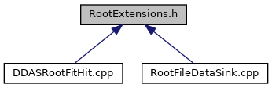

do not remove this div, it is closed by doxygen! 
|  |
| --- |
| DDASToys for NSCLDAQ6.2-000 |

 end header part 
 Generated by Doxygen 1.9.1 

 window showing the filter options 

 iframe showing the search results (closed by default) 

- [[EEConverter|dir_04a3fafa7c4b2a9dfdb897dd54125b19]]

 top 
[Classes](#nested-classes)

RootExtensions.h File Reference

header
Provide streamable versions of the event extensions defined in [[fit_extensions.h|fit__extensions_8h]].  
[More...](#details)

`#include <fit_extensions.h>`  

`#include <TObject.h>`

Include dependency graph for RootExtensions.h:

This graph shows which files directly or indirectly include this file:

[[Go to the source code of this file.|RootExtensions_8h_source]]

|  |  |
| --- | --- |
| Classes |
| struct | ddastoys::RootPulseDescription |
|  | Describes a single pulse without an offset.More... |
|  |
| struct | ddastoys::RootFit1Info |
|  | Full fitting information for the single pulse.More... |
|  |
| struct | ddastoys::RootFit2Info |
|  | Full fitting information for the double pulse.More... |
|  |
| struct | ddastoys::RootHitExtension |
|  | The data structure containing the full fit information.More... |
|  |

## Detailed Description

Provide streamable versions of the event extensions defined in [[fit_extensions.h|fit__extensions_8h]].

These structs mirror those having to do with the fit extensions to DDAS data, but they support ROOT serialization and, therefore, can be put into ROOT files/tree leaves.

 contents 
 start footer part 

---

Generated by  1.9.1
