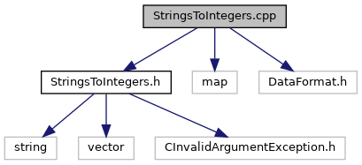

do not remove this div, it is closed by doxygen! 
|  |
| --- |
| DDASToys for NSCLDAQ6.2-000 |


 end header part 
 Generated by Doxygen 1.9.1 


 window showing the filter options 


 iframe showing the search results (closed by default) 


- [[EEConverter|https://github.com/FRIBDAQ/docs/tree/main/ddastoys-6.2-000/dir_04a3fafa7c4b2a9dfdb897dd54125b19.md]]

 top 
[Functions](#func-members)


StringsToIntegers.cpp File Reference

header
Functions to convert lists of comma-delimited integers to a vector of ints.  
[More...](#details)


`#include "StringsToIntegers.h"`  

`#include <map>`  

`#include <DataFormat.h>`

Include dependency graph for StringsToIntegers.cpp:




|  |  |
| --- | --- |
| Functions |
| vector< int > | stringListToIntegers(string items) |
|  |


<a name="details"></a>## Detailed Description


Functions to convert lists of comma-delimited integers to a vector of ints.

## Function Documentation


## [◆](#a12f737832d6a9e60f6ea206541c26057)stringListToIntegers()


|  |  |  |  |  |  |
| --- | --- | --- | --- | --- | --- |
| vector<int> stringListToIntegers | ( | string | items | ) |  |

This is most useful in decoding things like:


```
*   ... --exclude=1,2,3 ...
* 
```

 contents 
 start footer part 

---


Generated by [](https://www.doxygen.org/index.html) 1.9.1
