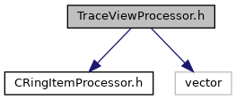
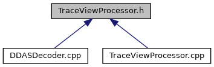

do not remove this div, it is closed by doxygen! 
|  |
| --- |
| DDASToys for NSCLDAQ6.2-000 |

 end header part 
 Generated by Doxygen 1.9.1 

 window showing the filter options 

 iframe showing the search results (closed by default) 

- [[TraceView|https://github.com/FRIBDAQ/docs/tree/main/ddastoys-6.2-000/dir_618b423c2be057087b8e9298ecdc31ba.md]]

 top 
[Classes](#nested-classes)

TraceViewProcessor.h File Reference

header
Defines an event processor class for handing DDAS events.  
[More...](#details)

`#include <CRingItemProcessor.h>`  

`#include <vector>`

Include dependency graph for TraceViewProcessor.h:

This graph shows which files directly or indirectly include this file:

[[Go to the source code of this file.|https://github.com/FRIBDAQ/docs/tree/main/ddastoys-6.2-000/TraceViewProcessor_8h_source.md]]

|  |  |
| --- | --- |
| Classes |
| class | TraceViewProcessor |
|  | A basic ring item processor.More... |
|  |

## Detailed Description

Defines an event processor class for handing DDAS events.

 contents 
 start footer part 

---

Generated by  1.9.1
